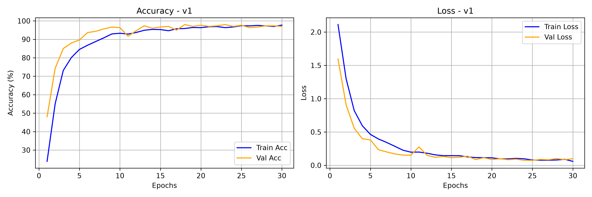
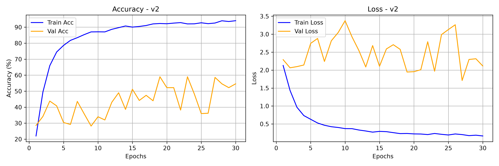
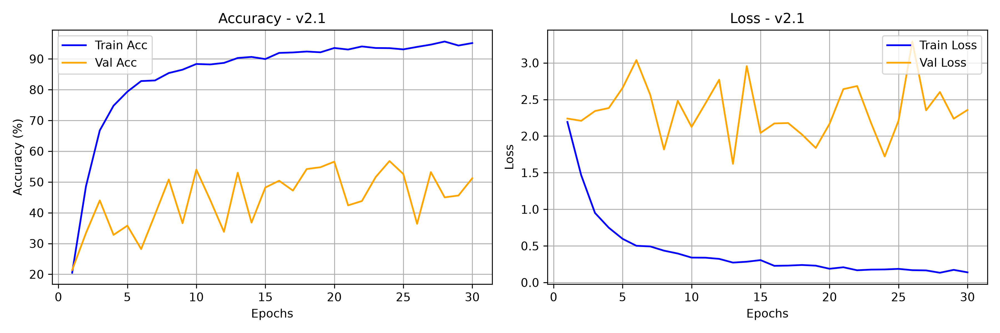
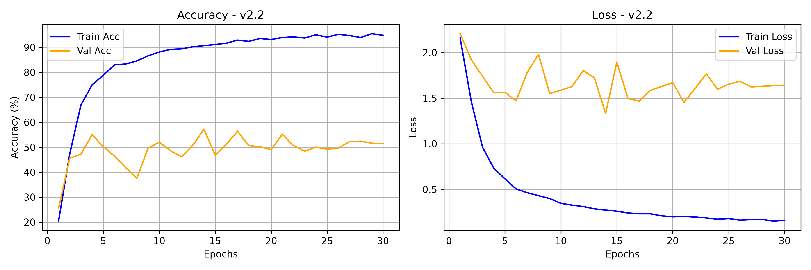
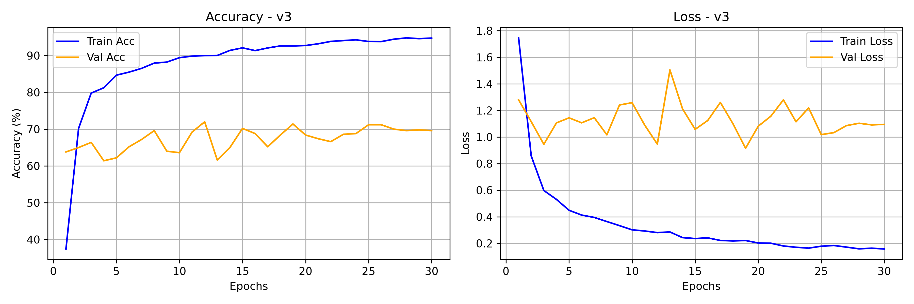
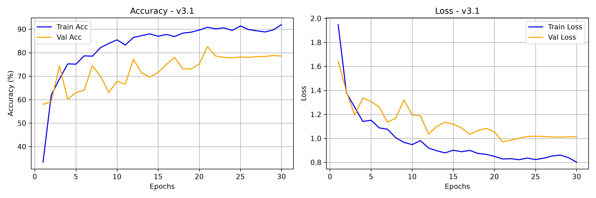

# 🎙️ FSDD - Spoken Digit Classification

Spoken digit recognition pipeline (digits 0–9) based on the **FSDD** (*Free Spoken Digit Dataset*) and augmented with **AudioMNIST**.  
This project documents the evolution from a naive baseline to a robust, **speaker-independent** CNN architecture.

---

## 📐 Audio Technical Specifications

* **Sampling Rate ($f_s$)**: 8,000 Hz (mono)
* **Normalized Duration**: 1.0 second (8,000 samples)
* **Spectral Representation**: Log-Mel Spectrogram
  * `n_mels`: 64
  * `n_fft`: 512 (~64 ms window)
  * `hop_length`: 256 (~32 ms step)
  * **Input Tensor Shape**: `[Batch, 1, 64, 32]`

---

## 📈 Version History & Project Evolution

### 🔹 Version 1.0 — Baseline (Random Split | 3,000 Audio Files)
* **Dataset Scope**: Original FSDD dataset (6 speakers $\times$ 500 clips = 3,000 total audio samples).
* **Data Split**: Naive 80/20 random split mixing all 6 speakers across train and validation sets.
* **Outcome**: High accuracy (~98%+), but severely **overfitted to speaker identity**. The model memorized specific voice signatures present in both sets instead of learning digit phonemes.

---

### 🔹 Version 2.0 — Speaker-Independent Split (3,000 Audio Files)
* **Goal**: Evaluate true generalization on completely unseen voices.
* **Strict Speaker Separation**:
  * **Train Set (4 speakers / 2,000 samples)**: `jackson`, `nicolas`, `theo`, `yweweler`
  * **Validation Set (1 speaker / 500 samples)**: `lucas`
  * **Test Set (1 speaker / 500 samples)**: `george`
* **Observation**: Validation accuracy dropped sharply below 50%. The model failed to generalize to `lucas` due to reliance on fundamental frequencies ($F_0$) of the 4 training male voices.

---

### 🔹 Version 2.1 — Data Augmentation (Acoustic Perturbations)
* **Goal**: Artificially expand acoustic diversity within the 4 training speakers.
* **Techniques Introduced**:
  * **Additive White Noise**: Low-level Gaussian noise injection ($20\%$ chance).
  * **SpecAugment**: Frequency (`FrequencyMasking`) and time (`TimeMasking`) band erasure.

---

### 🔹 Version 2.2 — Speaker Invariance & Regularization (Accuracy Bottleneck: 57.2%)
* **Goal**: Strip speaker identity (timbre/pitch/volume) at the architectural level.
* **Upgrades Introduced**:
  1. **Per-Sample Instance Standardization**: Zero-mean unit-variance scaling per spectrogram $X_{norm} = \frac{X - \mu}{\sigma + \epsilon}$.
  2. **`InstanceNorm2d` Layers**: Replaced BatchNorm in `model.py` to eliminate channel-wise speaker style.
  3. **Regularization**: Increased `Dropout(0.4)`, added `weight_decay=1e-4` (L2), and integrated `CosineAnnealingLR`.
* **Key Bottleneck Identified**: Despite all architectural optimizations, validation accuracy **capped out at 57.2%**. Dissecting the failure proved that 4 training speakers (all male) provided insufficient acoustic variance for the network to learn pitch-invariant features.

---

### 🔹 Version 3.0 — Dataset Expansion & Gender Balancing (5,000 Audio Files)
* **Goal**: Eliminate the voice-signature bottleneck by scaling training speaker diversity and balancing pitch distributions.
* **Dataset Augmentation**: Integrated 2,000 audio samples from **4 female speakers** (`01`, `08`, `12`, `14`) from the **AudioMNIST** dataset.
* **Updated Data Split**:
  * **Train Set (8 speakers / 4,000 samples)**: 4 FSDD males + 4 AudioMNIST females (50/50 gender balance, broad $F_0$ spectrum).
  * **Validation Set (1 speaker / 500 samples)**: `lucas` (FSDD — kept strictly identical to benchmark v2.0–v2.2 improvements).
  * **Test Set (1 speaker / 500 samples)**: `george` (FSDD — unseen holdout).

---

### 🔹 Version 3.1 — CUDA Pipeline & Magnet Class Dissolution (Accuracy Jump: 82.5%)
* **Goal**: Offload heavy computational processing to GPU, eliminate speed bottlenecks, and resolve phoneme ambiguity across magnet classes (e.g., '3' and '5').
* **Upgrades Introduced**:
  1. **CUDA Batch Processing Engine**: Moved Mel-Spectrogram extraction and all acoustic transformations directly onto GPU VRAM inside `train.py` (CPU `dataset.py` acts solely as a fast raw tensor loader).
  2. **On-the-Fly GPU Augmentations**:
     * **Pitch Shift**: Random variation ($\pm 2$ semitones) via `torchaudio.functional.pitch_shift` (30% probability).
     * **Time Shift**: Circular tensor rolling ($\pm 100$ ms) on GPU (30% probability).
     * **SpecAugment**: Dynamic time and frequency masking on VRAM tensors.
  3. **Magnet Class Dissolution**: Applied `CrossEntropyLoss(label_smoothing=0.1)` to penalize overconfident misclassifications on close phonetic bounds.
* **Outcome**: Peak validation accuracy jumped to **82.5%**, establishing stable convergence with high training speed.

---

## 📊 Training Curves & Performance Progression

| Version | Best Val Acc | Training Curves |
| :--- | :---: | :--- |
| **v1.0** | **98.2%** |  |
| **v2.0** | **~48.0%** |  |
| **v2.1** | **~52.0%** |  |
| **v2.2** | **57.2%** |  |
| **v3.0** | **~74.0%** |  |
| **v3.1** | **82.5%** |  |

---

## 📁 Project Structure

```text
.
├── data/
│   ├── recordings/          # Raw FSDD and AudioMNIST WAV files
│   └── metadata.py          # Audio metadata (speaker, gender, age, etc.)
├── models/                  # Versioned checkpoints
├── models_data/             # history files and visual plots
├── dataset.py               # Fast raw waveform CPU DataLoader
├── model.py                 # SpokenDigitCNN architecture (InstanceNorm2d, Dropout)
├── train.py                 # GPU-accelerated training pipeline & augmentations
├── evaluate.py              # Confusion matrix & classification report exporter
├── app.py                   # Interactive evaluation interface
└── README.md                # Project documentation