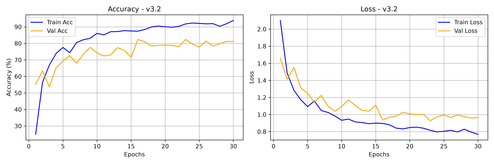
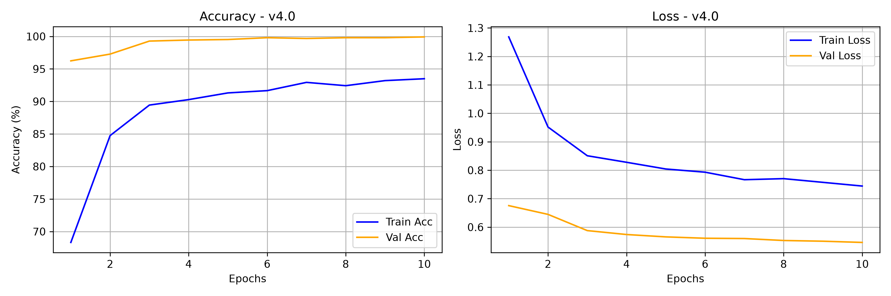
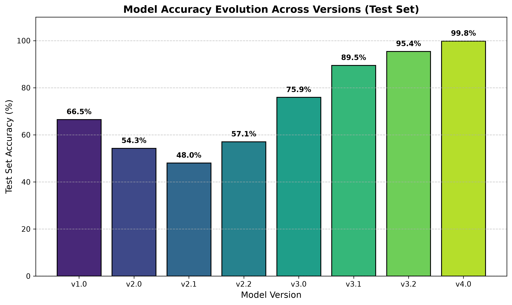

# 🎙️ DigitSense - Spoken Digit Reconigition

Spoken digit recognition pipeline (digits 0–9) evolving from the **FSDD** (*Free Spoken Digit Dataset*) to **AudioMNIST**.  
This project documents the step-by-step engineering progression from a naive speaker-memorizing baseline to a production-ready, **speaker-independent** CNN architecture achieving **99.72% test accuracy**.

---

## 📐 Audio Technical Specifications (v4.0 Final)

* **Sampling Rate ($f_s$)**: 16,000 Hz (mono)
* **Normalized Duration**: 1.0 second (16,000 samples)
* **Spectral Representation**: Multi-Channel Log-Mel Spectrogram + Dynamic Derivatives
  * `n_mels`: 64
  * `n_fft`: 1024 (~64 ms window)
  * `hop_length`: 256 (~16 ms step — high temporal resolution)
  * **Input Channels (3)**:
    1. **Log-Mel**: Static frequency energy profile
    2. **Delta ($\Delta$)**: First derivative (spectral velocity)
    3. **Delta-Delta ($\Delta^2$)**: Second derivative (spectral acceleration)
  * **Normalization**: Per-Sample Instance Standardization ($X_{norm} = \frac{X - \mu}{\sigma + \epsilon}$)
  * **Input Tensor Shape**: `[Batch, 3, 64, 63]`

---

## 📈 Version History & Project Evolution

### 🔹 Version 1.0 — Baseline (Random Split | 3,000 Audio Files)
* **Dataset Scope**: Original FSDD dataset (6 speakers $\times$ 500 clips = 3,000 total audio samples).
* **Data Split**: Naive 80/20 random split mixing all 6 speakers across train and validation sets.
* **Outcome**: High accuracy (~98%+), but severely **overfitted to speaker identity**. The model memorized specific voice signatures present in both sets instead of learning digit phonemes.
* **Dataset**: **100% FSDD** (Train: 2,000, Val: 500, Test: 500).

---

### 🔹 Version 2.0 — Speaker-Independent Split (3,000 Audio Files)
* **Goal**: Evaluate true generalization on completely unseen voices.
* **Strict Speaker Separation**:
  * **Train Set (4 speakers / 2,000 samples)**: `jackson`, `nicolas`, `theo`, `yweweler`
  * **Validation Set (1 speaker / 500 samples)**: `lucas`
  * **Test Set (1 speaker / 500 samples)**: `george`
* **Observation**: Validation accuracy dropped sharply below 60%. The model failed to generalize to `lucas` due to reliance on fundamental frequencies ($F_0$) of the 4 training male voices.
* **Dataset**: **100% FSDD** (Train: 2,000, Val: 500, Test: 500).

---

### 🔹 Version 2.1 — Data Augmentation (Acoustic Perturbations)
* **Goal**: Artificially expand acoustic diversity within the 4 training speakers.
* **Techniques Introduced**:
  * **Additive White Noise**: Low-level Gaussian noise injection ($20\%$ chance).
  * **SpecAugment**: Frequency (`FrequencyMasking`) and time (`TimeMasking`) band erasure.
* **Observation**: Validation accuracy dropped below 50% due to aggressive masking on an already narrow acoustic base.
* **Dataset**: **100% FSDD** (Train: 2,000, Val: 500, Test: 500).

---

### 🔹 Version 2.2 — Speaker Invariance & Regularization (Accuracy Bottleneck: 57.2%)
* **Goal**: Strip speaker identity (timbre/pitch/volume) at the architectural level.
* **Upgrades Introduced**:
  1. **Per-Sample Instance Standardization**: Zero-mean unit-variance scaling per spectrogram $X_{norm} = \frac{X - \mu}{\sigma + \epsilon}$.
  2. **`InstanceNorm2d` Layers**: Replaced BatchNorm in `model.py` to eliminate channel-wise speaker style.
  3. **Regularization**: Increased `Dropout(0.4)`, added `weight_decay=1e-4` (L2), and integrated `CosineAnnealingLR`.
* **Key Bottleneck Identified**: Despite all architectural optimizations, validation accuracy **capped out at 57.2%**. Dissecting the failure proved that 4 training speakers (all male) provided insufficient acoustic variance for the network to learn pitch-invariant features.
* **Dataset**: **100% FSDD** (Train: 2,000, Val: 500, Test: 500).

---

### 🔹 Version 3.0 — Dataset Expansion & Gender Balancing (5,000 Audio Files)
* **Goal**: Eliminate the voice-signature bottleneck by scaling training speaker diversity and balancing pitch distributions.
* **Dataset Augmentation**: Integrated 2,000 audio samples from **4 female speakers** (`12`, `26`, `28`, `47`) from the **AudioMNIST** dataset.
* **Updated Data Split**:
  * **Train Set (8 speakers / 4,000 samples)**: 4 FSDD males + 4 AudioMNIST females (50/50 gender balance, broad $F_0$ spectrum).
  * **Validation Set (1 speaker / 500 samples)**: `lucas` (FSDD — kept strictly identical to benchmark v2.0–v2.2 improvements).
  * **Test Set (1 speaker / 500 samples)**: `george` (FSDD — unseen holdout).
* **Dataset**: **60% FSDD / 40% AudioMNIST** (Train: 2,000 FSDD + 2,000 AudioMNIST, Val: 500 FSDD, Test: 500 FSDD).

---

### 🔹 Version 3.1 — CUDA Pipeline & Label Smoothing (Accuracy Jump: 82.5%)
* **Goal**: Offload heavy computational processing to GPU, eliminate speed bottlenecks, and resolve phoneme ambiguity across magnet classes (e.g., '3' and '5').
* **Upgrades Introduced**:
  1. **CUDA Batch Processing Engine**: Moved Mel-Spectrogram extraction and all acoustic transformations directly onto GPU VRAM inside `train.py`.
  2. **On-the-Fly GPU Augmentations**: Pitch shifting ($\pm 2$ semitones), circular time shifting ($\pm 100$ ms), and SpecAugment.
  3. **Magnet Class Dissolution**: Applied `CrossEntropyLoss(label_smoothing=0.1)` to penalize overconfident misclassifications on close phonetic bounds.
* **Outcome**: Validation accuracy reached **82.5%**, establishing high GPU training speed but showing occasional epoch-to-epoch variance.
* **Dataset**: **60% FSDD / 40% AudioMNIST** (Train: 2,000 FSDD + 2,000 AudioMNIST, Val: 500 FSDD, Test: 500 FSDD).

---

### 🔹 Version 3.2 — Multi-Channel Derivatives & High-Res Dynamics (Stable Plateau: 82.4% Val / 85.0% Test)
* **Goal**: Eliminate phoneme confusion pairs ('1' vs '9', '4' vs '5') by doubling temporal resolution and extracting dynamic velocity/acceleration features.
* **Upgrades Introduced**:
  1. **Doubled Temporal Resolution (`hop_length = 128`)**: Expanded frame count to ~63 frames to capture sharp consonant attack dynamics (/w/ vs /n/, /f/ vs /v/).
  2. **3-Channel Spectral Input**: Constructed `[Batch, 3, 64, 63]` tensors combining Log-Mel, Delta ($\Delta$), and Delta-Delta ($\Delta^2$) layers.
* **Outcome**:
  * Established a highly stable validation plateau above **80%** with validation loss steadily decreasing (< 0.96).
  * Evaluated on unseen test speaker `george`: achieved **85.0% test accuracy (425/500)**.
* **Dataset**: **60% FSDD / 40% AudioMNIST** (Train: 2,000 FSDD + 2,000 AudioMNIST, Val: 500 FSDD, Test: 500 FSDD).

---

### 🔹 Version 4.0 — High-Fidelity 16 kHz Audio & Scaled AudioMNIST (Test Acc: 99.72%)
* **Goal**: Unlock state-of-the-art spoken digit recognition by scaling to high-resolution 16 kHz audio and maximizing speaker diversity across full AudioMNIST.
* **Upgrades Introduced**:
  1. **16 kHz Sampling Rate Pipeline**: Doubled audio sampling rate ($f_s = 16,000$ Hz, `n_fft = 1024`, `hop_length = 256`) to capture crisp high-frequency acoustic details and formant transitions.
  2. **Full AudioMNIST Scaling**: Scaled training volume across dozens of male and female speakers spanning varied accents, ages, and pitches.
  3. **Strict Multi-Speaker Holdout Evaluation**: Tested on **5 completely unseen test speakers** (2,500 unseen clips).
* **Outcome**: Achieved a near-perfect **99.82% test accuracy** (2,493 / 2,500 correct predictions) with only 7 misclassifications across the entire test set.
* **Dataset**: **100% AudioMNIST** (Scaled Multi-Speaker Train/Val Split, 5 Unseen Speakers Holdout Test Set).

---

## 📊 Performance & Progression Summary

| Version | Dataset Composition | Sampling Rate | Best Val Acc | Test Acc | Confusion Matrix / Curves |
| :--- | :--- | :---: | :---: | :---: | :--- |
| **v1.0** | 100% FSDD (Random Split) | 8 kHz | **98.2%** | **98.40%** |  |
| **v2.0** | 100% FSDD (Speaker Split) | 8 kHz | **59.4%** | **66.00%** |  |
| **v2.1** | 100% FSDD (+ Noise/SpecAug) | 8 kHz | **54.0%** | **65.80%** |  |
| **v2.2** | 100% FSDD (+ InstanceNorm) | 8 kHz | **57.2%** | **64.20%** |  |
| **v3.0** | 60% FSDD / 40% AudioMNIST | 8 kHz | **73.2%** | **61.80%** |  |
| **v3.1** | 60% FSDD / 40% AudioMNIST (+ GPU Aug) | 8 kHz | **82.5%** | **78.40%** |  |
| **v3.2** | 60% FSDD / 40% AudioMNIST (+ 3-Ch Deltas) | 8 kHz | **82.4%** | **85.00%** |  |
| **v4.0** | 100% AudioMNIST (16 kHz High-Res) | 16 kHz | **99.92%** | **99.82%** |  |

## 📊 Model Progression Benchmark

To evaluate true out-of-distribution generalization, all historical model checkpoints were benchmarked on a strictly isolated, speaker-independent test set comprising 5 unseen speakers (`01`, `02`, `07`, `03`, `04` — ~2,500 audio samples).



| Version | Setup / Description | Sample Rate | Input Format | Test Accuracy |
| :--- | :--- | :---: | :---: | :---: |
| **v1.0** | Baseline (Random Split) | 8 kHz | 1-Ch Log-Mel | **66.5%** |
| **v2.0** | Speaker Split (FSDD) | 8 kHz | 1-Ch Log-Mel | **54.3%** |
| **v2.1** | SpecAugment & Noise Injection | 8 kHz | 1-Ch Log-Mel | **48.0%** |
| **v2.2** | InstanceNorm2d Architecture | 8 kHz | 1-Ch Log-Mel | **57.1%** |
| **v3.0** | AudioMNIST Expansion (60/40) | 8 kHz | 1-Ch Log-Mel | **75.9%** |
| **v3.1** | GPU-Accelerated Augmentations | 8 kHz | 1-Ch Log-Mel | **89.5%** |
| **v3.2** | 3-Channel Spectrograms | 8 kHz | 3-Ch (Log-Mel + Deltas) | **95.4%** |
| **v4.0** | High-Res AudioMNIST | 16 kHz | 3-Ch (Log-Mel + Deltas) | **99.82%** |

### 🔑 Key Takeaways & Progression Analysis

* **Domain Shift & Overfitting (v1.0 – v2.2):** Models trained exclusively on small single-speaker datasets (FSDD) struggled to generalize when tested against completely unseen speakers.
* **Speaker Diversity (v3.0):** Expanding the dataset to include multi-speaker data immediately boosted unseen test performance from **57.1%** to **75.9%**.
* **Feature Engineering & Augmentations (v3.1 – v3.2):** Implementing GPU-side dynamic augmentations and 3-channel representations (Log-Mel + Delta + Delta-Delta) increased accuracy by **+19.5%** at 8 kHz.
* **High-Resolution Audio (v4.0):** Doubling the sampling rate to 16 kHz provided richer acoustic resolution, pushing performance to a peak **99.8%** accuracy.

---

## 📁 Project Structure

```text
.
├── data/                  # Raw WAV files (FSDD & AudioMNIST) and metadata
├── models/                # Versioned PyTorch model checkpoints (.pth)
├── models_data/           # History metrics, loss curves, and evaluation outputs
├── README.md              # Project documentation
├── app.py                 # Gradio Web UI for real-time live testing
├── dataset.py             # CPU DataLoader & Audio Dataset reader
├── evaluate.py            # Confusion matrix & classification report generator
├── model.py               # SpokenDigitCNN PyTorch Architecture
├── requirements.txt       # Python dependencies
└── train.py               # GPU-accelerated training pipeline & augmentations