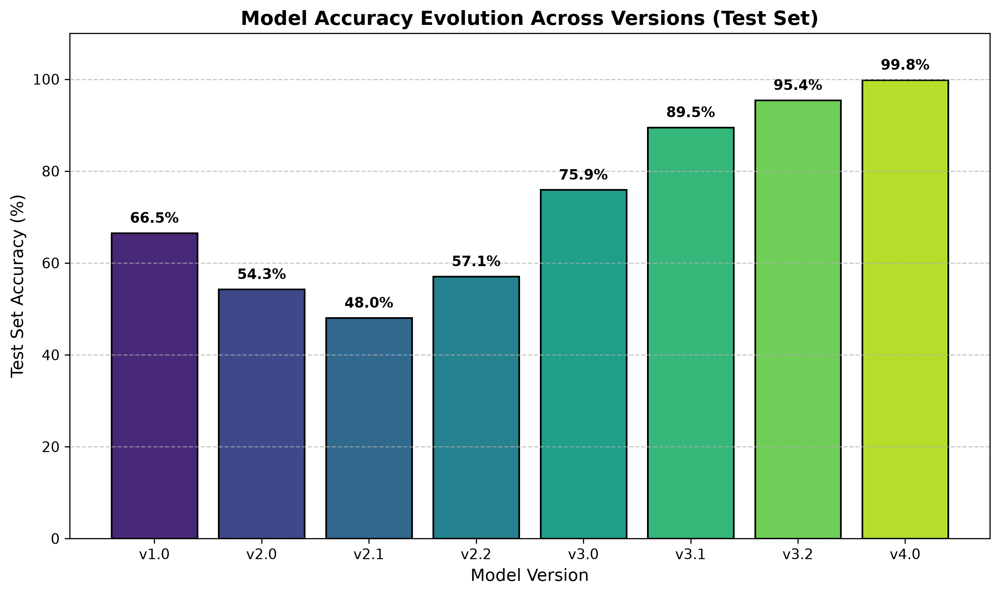
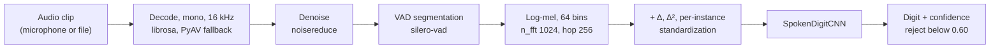

# DigitSense — Spoken Digit Recognition

<p align="center">
  <a href="https://github.com/Hades-Highness/spoken-digit-recognition/releases/tag/V4.0.0">
    
  </a>
  
  
  <a href="LICENSE"></a>
</p>

<p align="center">
  <a href="#quickstart">Quickstart</a> ·
  <a href="#results">Results</a> ·
  <a href="#model-cards">Model cards</a> ·
  <a href="#training">Training</a> ·
  <a href="#evaluation">Evaluation</a> ·
  <a href="#web-app">Web app</a> ·
  <a href="#datasets">Datasets</a> ·
  <a href="#citation">Citation</a>
</p>

---

## Overview

DigitSense is an end-to-end spoken digit recognition project: raw audio in, a digit (0–9) and a
confidence score out. It ships as a small PyTorch CNN (`SpokenDigitCNN`, ≈156 K parameters)
trained on 3-channel log-mel features, a Gradio interface for live microphone testing, and a
versioned record of how the model evolved across eight iterations.

The current model (**v4.0**) reaches **99.72 % accuracy — 2,493 of 2,500 clips — on a
speaker-independent test set of five speakers absent from training**, with 7 misclassifications
in total and per-class recall between 99.2 % and 100 %.

The main contribution of the repository is the recorded progression rather than the final number.
It documents why a naive split inflates accuracy to 98 %, and which specific changes lifted
generalisation to unseen voices from 48 % to 99.7 %.

**What this repository is:** a reproducible v4.0 pipeline (training, evaluation, ONNX/PyTorch
inference, web demo), the metrics, curves and confusion matrices of all previous versions, and a
model card per version.

**What it is not:** a production ASR system. See [Reproducibility and limitations](#reproducibility-and-limitations).

---

## Results

### Headline (v4.0)

| Metric | Value | Source of truth |
| :--- | :--- | :--- |
| Test accuracy (5 unseen speakers, 2,500 clips) | **99.72 %** (2,493 / 2,500) | `models_data/model_v4/report_v4.txt` |
| Best validation accuracy (5 held-out speakers) | 99.92 % | `models_data/model_v4/history_v4.json` |
| Misclassifications | 7 | `report_v4.txt` (250 clips per class) |
| Macro-average F1 | 0.9972 | `report_v4.txt` |
| Parameters / checkpoint size | ≈156 K / 631,651 bytes | `models/digitsense_v4.0.pth` |

### Version progression

All values below are read from the committed artifacts in `models_data/`. The two test columns use
**different protocols and are not comparable to each other**: `Test (1 unseen speaker)` evaluates
on the FSDD speaker `george` (500 clips, 8 kHz), while `Test (5 unseen speakers)` uses the
AudioMNIST multi-speaker holdout (2,500 clips, 16 kHz for v4.0).

| Version | What changed | Data | Rate | Input | Best val acc | Test (1 unseen speaker) | Model card |
| :--- | :--- | :--- | :---: | :--- | :---: | :---: | :--- |
| v1.0 | Baseline CNN | FSDD, naive random 80/20 | 8 kHz | 1-ch | 98.0 % | 98.40 % (in-distribution) | [v1.0](model_cards/model_card_v1.0.md) |
| v2.0 | Speaker-independent split | FSDD, 4 train / 1 val / 1 test speaker | 8 kHz | 1-ch | 59.0 % | 66.00 % | [v2.0](model_cards/model_card_v2.0.md) |
| v2.1 | Noise injection + SpecAugment | FSDD | 8 kHz | 1-ch | 56.8 % | 65.80 % | [v2.1](model_cards/model_card_v2.1.md) |
| v2.2 | `InstanceNorm2d`, stronger regularization | FSDD | 8 kHz | 1-ch | 57.2 % | 64.20 % | [v2.2](model_cards/model_card_v2.2.md) |
| v3.0 | + 4 AudioMNIST speakers, gender balance | 60 % FSDD / 40 % AudioMNIST | 8 kHz | 1-ch | 72.0 % | 61.80 % | [v3.0](model_cards/model_card_v3.0.md) |
| v3.1 | GPU augmentations + label smoothing | 60 % FSDD / 40 % AudioMNIST | 8 kHz | 1-ch | 82.6 % | 77.40 % | [v3.1](model_cards/model_card_v3.1.md) |
| v3.2 | 3-channel features (log-mel + Δ + Δ²) | 60 % FSDD / 40 % AudioMNIST | 8 kHz | 3-ch | 82.4 % | 85.00 % (425/500) | [v3.2](model_cards/model_card_v3.2.md) |
| **v4.0** | 16 kHz, full AudioMNIST, 50/5/5 speaker split | AudioMNIST | 16 kHz | 3-ch | **99.92 %** | **99.72 %** (2,493/2,500) | [v4.0](model_cards/model_card_v4.0.md) |

### Cross-version benchmark

Every checkpoint re-evaluated on one fixed 5-speaker holdout (~2,500 clips), to separate the effect
of each change from the effect of the test set:



| Version | Setup | Rate | Input | Test accuracy |
| :--- | :--- | :---: | :--- | :---: |
| v1.0 | Baseline (random split) | 8 kHz | 1-ch | 66.5 % |
| v2.0 | Speaker split (FSDD) | 8 kHz | 1-ch | 54.3 % |
| v2.1 | SpecAugment & noise | 8 kHz | 1-ch | 48.0 % |
| v2.2 | `InstanceNorm2d` | 8 kHz | 1-ch | 57.1 % |
| v3.0 | AudioMNIST expansion (60/40) | 8 kHz | 1-ch | 75.9 % |
| v3.1 | GPU augmentations | 8 kHz | 1-ch | 89.5 % |
| v3.2 | 3-channel spectrograms | 8 kHz | 3-ch | 95.4 % |
| v4.0 | High-resolution AudioMNIST | 16 kHz | 3-ch | 99.72 % |

### What the progression shows

- **A random split hides speaker overfitting.** v1.0 reaches 98.4 % in-distribution and 66.5 % on
  unseen speakers: the model was partly recognising voices rather than digits.
- **Augmentation cannot replace speaker diversity.** On four male FSDD speakers, noise, SpecAugment
  and `InstanceNorm2d` plateau at 54–57 %, and the benchmark *drops* to 48.0 % in v2.1.
- **Adding speakers is the single largest gain** — +18.8 points from v2.2 to v3.0 (57.1 % → 75.9 %).
- **Representation and resolution add the rest** — +23.8 points from v3.0 to v4.0, with Δ/Δ²
  channels and a 16 kHz input both contributing.
- **A one-speaker test set is a noisy estimator.** v3.0 scores worse than v2.2 on `george`
  (61.8 % vs 64.2 %) while scoring far better on the five-speaker benchmark (75.9 % vs 57.1 %).

---

## Model cards

Each version has a model card documenting its configuration, its full classification report, its
training curves, its confusion matrix, and the caveats that apply to its numbers.

| Version | Card | Focus |
| :--- | :--- | :--- |
| v1.0 | [model_card_v1.0.md](model_cards/model_card_v1.0.md) | Baseline and the speaker-identity leak |
| v2.0 | [model_card_v2.0.md](model_cards/model_card_v2.0.md) | Honest speaker-independent baseline, 66.0 % |
| v2.1 | [model_card_v2.1.md](model_cards/model_card_v2.1.md) | Negative result: augmentation without diversity |
| v2.2 | [model_card_v2.2.md](model_cards/model_card_v2.2.md) | Architectural invariance fixes the loss, not accuracy |
| v3.0 | [model_card_v3.0.md](model_cards/model_card_v3.0.md) | Speaker diversity: the largest single gain |
| v3.1 | [model_card_v3.1.md](model_cards/model_card_v3.1.md) | Augmentation that works once the data supports it |
| v3.2 | [model_card_v3.2.md](model_cards/model_card_v3.2.md) | Dynamic features and temporal resolution |
| v4.0 | [model_card_v4.0.md](model_cards/model_card_v4.0.md) | **Current release**: 16 kHz, 50/5/5 speaker split |

Each card links back to the four artifacts in `models_data/model_v<version>/`: `report_v*.txt`
(per-class precision / recall / F1), `history_v*.json` (per-epoch accuracy and loss), `curve_v*.png`
and `cm_v*.png`.

---

## Pipeline


```mermaid
flowchart LR
    A["Audio clip<br/>(microphone or file)"] --> B["Decode, mono, 16 kHz<br/>librosa, PyAV fallback"]
    B --> C["Denoise<br/>noisereduce"]
    C --> D["VAD segmentation<br/>silero-vad"]
    D --> E["Log-mel, 64 bins<br/>n_fft 1024, hop 256"]
    E --> F["+ Δ, Δ², per-instance<br/>standardization"]
    F --> G["SpokenDigitCNN"]
    G --> H["Digit + confidence<br/>reject below 0.60"]
```

### Audio and feature specification (v4.0)

| Parameter | Value |
| :--- | :--- |
| Sampling rate | 16,000 Hz, mono |
| Duration | 1.0 s (16,000 samples; zero-padded or truncated) |
| `n_mels` | 64 |
| `n_fft` | 1024 (64 ms window) |
| `hop_length` | 256 (16 ms step) |
| Time frames | 63 |
| Channels | 3 — log-mel, Δ (first derivative), Δ² (second derivative) |
| Normalization | Per-instance standardization, $X_{norm} = (X - \mu) / (\sigma + \epsilon)$, $\epsilon = 10^{-6}$ |
| Input tensor | `[batch, 3, 64, 63]` |

The training transform lives in `train.py::process_batch_gpu` and the inference transform in
`preprocessing.py::extract_features`. Both must stay in sync; the constants are duplicated on
purpose so the inference path does not depend on training code.

### Model architecture

| Stage | Configuration | Output shape |
| :--- | :--- | :--- |
| Input | — | `[B, 3, 64, 63]` |
| Conv block 1 | `Conv2d(3→16, 3×3)`, `InstanceNorm2d(16)`, ReLU, `MaxPool2d(2)` | `[B, 16, 32, 31]` |
| Conv block 2 | `Conv2d(16→32, 3×3)`, `InstanceNorm2d(32)`, ReLU, `MaxPool2d(2)` | `[B, 32, 16, 15]` |
| Conv block 3 | `Conv2d(32→64, 3×3)`, `InstanceNorm2d(64)`, ReLU, `MaxPool2d(2)` | `[B, 64, 8, 7]` |
| Pooling | `AdaptiveAvgPool2d((4, 4))` — accepts any input resolution | `[B, 64, 4, 4]` |
| Head | Flatten → `Dropout(0.4)` → `Linear(1024→128)` → ReLU → `Dropout(0.4)` → `Linear(128→10)` | `[B, 10]` |

`InstanceNorm2d` (rather than `BatchNorm2d`) and per-instance standardization both remove
channel-wise speaker style (gain, offset, timbre). That decision dates from v2.2 and survives into
v4.0. Parameter count ≈156 K, i.e. a ≈0.63 MB checkpoint.

---

## Repository layout

```text
.
├── app.py                    # Gradio web interface (single- and multi-digit modes)
├── preprocessing.py          # Inference feature pipeline: decode, denoise, VAD, features
├── inference.py              # Model loading (ONNX → PyTorch fallback) and prediction
├── model.py                  # SpokenDigitCNN architecture + shape smoke test
├── dataset.py                # AudioMNIST dataset, 50/5/5 speaker-independent split
├── train.py                  # GPU-resident feature pipeline, augmentations, training loop
├── evaluate.py               # Confusion matrix + classification report for one checkpoint
├── requirements.txt          # Runtime dependencies (unpinned)
├── LICENSE                   # MIT
├── models/                   # Shipped checkpoints: digitsense_v1.0.pth … digitsense_v4.0.pth
├── model_cards/              # One model card per version, with metrics and figures
│   └── model_card_v1.0.md … model_card_v4.0.md
├── models_data/              # Per-version metrics: cm_*.png, curve_*.png, history_*.json, report_*.txt
│   ├── benchmark_comparison.png
│   └── model_v1/ … model_v4/
└── data/                     # Datasets (git-ignored — see Datasets)
```

---

## Quickstart

### 1. Install

```bash
git clone https://github.com/Hades-Highness/spoken-digit-recognition.git
cd spoken-digit-recognition
python -m venv .venv && source .venv/bin/activate     # Windows: .venv\Scripts\activate
pip install -r requirements.txt
```

The v4.0 checkpoint (`models/digitsense_v4.0.pth`) is committed, so the demo runs without training.
`torch` and `torchaudio` install a CPU build by default; for GPU training, install the CUDA build
matching your driver from the PyTorch index first.

### 2. Run the web app

```bash
python app.py
```

Open the printed local URL, record a digit with the microphone (or upload a clip), press
**Recognize**. See [Web app](#web-app) for what the interface does.

### 3. Check the architecture loads

```bash
python model.py     # prints "Architecture check passed." and the output shape
```

### 4. (Optional) ONNX backend

Drop `digitsense_v4.0.onnx` (from the [V4.0.0 release](https://github.com/Hades-Highness/spoken-digit-recognition/releases/tag/V4.0.0))
into `onnx/`. `inference.py` prefers ONNX Runtime when the file exists and the graph's input shape
matches the 63-frame feature tensor, and falls back to the PyTorch checkpoint otherwise.

---

## Training

### 1. Get the data

Download **AudioMNIST** and arrange it so `dataset.py` finds `data/<speaker_id>/*.wav` with file
names of the form `<digit>_<speaker_id>_<index>.wav`:

```text
data/
├── 01/
│   └── 0_01_0.wav …
├── 02/
└── …
```

Source recordings are 48 kHz; `dataset.py` reads each file's rate and resamples to 16 kHz on load.
`dataset.py` builds the split from `TEST_SPEAKERS` / `VAL_SPEAKERS` (5 + 5 of the 60 speakers; the
remaining 50 are training speakers) and raises `FileNotFoundError` if `data/*/*.wav` is empty.

```bash
python dataset.py     # prints the train / val / test sample counts
```

### 2. Train

```bash
python train.py
```

| Setting | Value (in `train.py`) |
| :--- | :--- |
| Epochs | 35 |
| Optimizer | Adam, lr `1e-3`, weight decay `1e-4` |
| Schedule | `CosineAnnealingLR(T_max=epochs)` |
| Loss | `CrossEntropyLoss(label_smoothing=0.1)` |
| Batch size | 64 |
| Seed | 42 (Python, NumPy, PyTorch, CUDA) |
| Feature extraction | On GPU, inside the training loop |
| Checkpoint selection | Best validation accuracy → `models/digitsense_v4.0.pth` |
| Outputs | `models/digitsense_v4.0.pth`, `curve_v4.0.png`, `history_v4.0.json` |

The history JSON also records the configuration that produced it, under a `config` key.

### 3. Augmentations (training only, applied on GPU)

| Augmentation | Probability | Range |
| :--- | :--- | :--- |
| Pitch shift | 30 % | ±2 semitones |
| Circular time shift | 30 % | ±1,600 samples (±100 ms) |
| Additive white noise | 20 % | $\sigma = 0.005$ |
| SpecAugment | 30 % of batches | `FrequencyMasking(10)`, `TimeMasking(12)` |

Validation and test use the same feature pipeline without augmentations. Because augmentations and
label smoothing apply only to training batches, **training accuracy is expected to sit below
validation accuracy** — this is visible in `curve_v4.png` and is not a sign of underfitting.

---

## Evaluation

```bash
python evaluate.py                                   # v4.0 on the test split
python evaluate.py --version v3.2 --out-dir models_data/model_v3.2
python evaluate.py --version v4.0 --split val
```

`evaluate.py` loads `models/digitsense_<version>.pth` and writes `cm_<version>.png` (10×10
confusion matrix, 300 dpi) and `report_<version>.txt` (per-class precision / recall / F1 and overall
accuracy) into `--out-dir`.

> `evaluate.py` reproduces the **v4.0** feature recipe (16 kHz, 3-channel), which is the only one
> the current `model.py` can consume — it expects 3 input channels. Checkpoints v1.0–v3.1 were
> trained on 1-channel log-mel, so re-evaluating them requires restoring their model definition and
> their 8 kHz feature pipeline first.

---

## Web app

`app.py` starts a Gradio interface with two modes:

| Mode | Behaviour |
| :--- | :--- |
| **Single Digit** | VAD-trims the clip to the first speech span and predicts one digit |
| **Multi-Digit** | Splits the recording into one segment per detected burst and predicts a digit per segment |

Both modes show the waveform (with VAD spans highlighted) and the log-mel spectrogram of the
processed input, plus the per-digit or per-segment probabilities. Predictions below the confidence
threshold (0.60) are rejected with a retry prompt instead of being displayed as a digit.

Inference details worth knowing:

- Browser recordings arrive as WebM/Opus, which libsndfile cannot read; `preprocessing.py` decodes
  them with PyAV as a fallback, so no system FFmpeg is required.
- Silent or unreadable clips are rejected before reaching the model.
- If no usable model file is found, the UI shows an explicit error banner naming the expected
  checkpoint path instead of failing silently.

---

## ONNX inference

`inference.py` resolves the backend in this order:

1. `onnx/digitsense_v4.0.onnx` via ONNX Runtime (CPU provider), **if** the exported graph's static
   input shape matches the real 63-frame feature tensor.
2. `models/digitsense_v4.0.pth` via PyTorch (CUDA if available, else CPU).
3. Otherwise the engine reports itself unavailable and the app explains why.

This exists because the model is small enough that CPU-only ONNX inference is convenient for demos,
while training remains PyTorch. The shape check prevents a stale export from silently producing
wrong predictions.

---

## Datasets

| Dataset | Speakers | Clips | Source rate | Layout expected by this repo | Licence |
| :--- | :---: | :---: | :---: | :--- | :--- |
| [AudioMNIST](https://github.com/soerenab/AudioMNIST) | 60 | 30,000 | 48 kHz | `data/<speaker_id>/<digit>_<speaker>_<index>.wav` | MIT |
| [FSDD](https://github.com/Jakobovski/free-spoken-digit-dataset) | 6 | 3,000 | 8 kHz | `{digit}_{speakerName}_{index}.wav` | CC BY-SA 4.0 |

- **v4.0 (the shipped model)** uses AudioMNIST only, with a 50 / 5 / 5 speaker split.
- **v1.0 – v3.2** were trained on FSDD and a 60/40 FSDD + AudioMNIST mixture at 8 kHz. Those data
  pipelines are **not** part of this repository any more, so the historical metrics in
  `models_data/` are preserved as records but cannot be regenerated from this code.
- Dataset licences are independent of the code licence: FSDD is share-alike (CC BY-SA 4.0), which
  is more restrictive than this project's MIT licence. Cite both datasets (see
  [Citation](#citation)).

---

## Reproducibility and limitations

**Reproducible today:** v4.0 training and evaluation from AudioMNIST, and v4.0 inference via
PyTorch or ONNX.

**Known gaps and limitations:**

- **The shipped v4.0 checkpoint does not match the current `train.py`.** `history_v4.json` records
  10 epochs; `train.py` is configured for 35. Either the run was stopped early or the configuration
  changed afterwards. The same mismatch exists for v3.2 (30 recorded epochs).
- **Historical checkpoints are not loadable by the current architecture.** v1.0–v3.1 used 1-channel
  log-mel, while `model.py` builds `Conv2d(in_channels=3, ...)`. Verify with
  `python -c "import torch; print(torch.load('models/digitsense_v1.0.pth')['conv1.0.weight'].shape)"`.
- **The cross-version benchmark is not reproducible.** It is backed only by an image, and its
  speaker list contradicts `dataset.py` (see [Cross-version benchmark](#cross-version-benchmark)).
- **The ONNX export script is git-ignored**, so the shipped `.onnx` files cannot be regenerated
  from the repository.
- **Metrics are single-run.** Training was unseeded for every version up to v3.2; the patch adding
  a seed to `train.py` does not retroactively make those runs reproducible.
- Clips are force-fitted to 1.0 s, so utterances longer than one second are truncated, and the
  silence-trimmed FSDD/AudioMNIST clips are zero-padded when shorter.
- Scope: single spoken digits (0–9), one utterance per VAD segment, English digit words, close-mic
  recordings. The confidence threshold (0.60) is a fixed heuristic, not a calibrated probability,
  and no explicit noise-robustness training was performed beyond light augmentation.

---

## Roadmap

- [ ] Re-run v4.0 with the seed in place and record the true configuration and epoch count, then
      update `history_v4.json` and the [v4.0 model card](model_cards/model_card_v4.0.md).
- [ ] Commit the benchmark script and its CSV/JSON output, and settle the holdout speaker list.
- [ ] Commit the ONNX export script (currently git-ignored).
- [ ] Add a screenshot or short GIF of the web interface to the README and to
      [Web app](#web-app).
- [ ] Add a smoke-test suite and a CI workflow (lint, `python model.py`, one training batch).
- [ ] Pin dependency versions, or add a `pyproject.toml` / lock file.
- [ ] Record the hardware used and the wall-clock training time per version.
- [ ] Add a BibTeX entry for the project itself so others can cite DigitSense.
- [ ] Restore the historical 8 kHz pipelines in an `archive/` folder if the v1.0–v3.2 checkpoints
      are to remain comparable.

---

## Citation


**AudioMNIST** (used by v4.0):

```bib
@article{audiomnist2023,
    title = {AudioMNIST: Exploring Explainable Artificial Intelligence for audio analysis on a simple benchmark},
    journal = {Journal of the Franklin Institute},
    year = {2023},
    issn = {0016-0032},
    doi = {https://doi.org/10.1016/j.jfranklin.2023.11.038},
    author = {Sören Becker and Johanna Vielhaben and Marcel Ackermann and Klaus-Robert Müller and Sebastian Lapuschkin and Wojciech Samek},
    keywords = {Deep learning, Neural networks, Interpretability, Explainable artificial intelligence, Audio classification, Speech recognition},
}
```

**FSDD** (used by v1.0–v3.2): see the
[Free Spoken Digit Dataset repository](https://github.com/Jakobovski/free-spoken-digit-dataset),
which is versioned on Zenodo — cite the DOI of the version you used.

---

## Licence

This project is released under the [MIT License](LICENSE) — © 2026 Hades-Highness.

The datasets keep their own terms: AudioMNIST is distributed under the MIT License and FSDD under
CC BY-SA 4.0. Model checkpoints in `models/` and release assets are covered by this project's MIT
licence, but any use of the datasets to retrain or redistribute models must respect the dataset
licences as well.

---

## Acknowledgements

- [AudioMNIST](https://github.com/soerenab/AudioMNIST) and
  [FSDD](https://github.com/Jakobovski/free-spoken-digit-dataset) for the data.
- [silero-vad](https://github.com/snakers4/silero-vad) for voice activity detection.
- [noisereduce](https://github.com/timsainb/noisereduce) for spectral-gate denoising.
- [Gradio](https://github.com/gradio-app/gradio), [PyTorch](https://pytorch.org/),
  [torchaudio](https://pytorch.org/audio/), [librosa](https://librosa.org/) and
  [PyAV](https://github.com/PyAV-Org/PyAV) for the framework stack.
