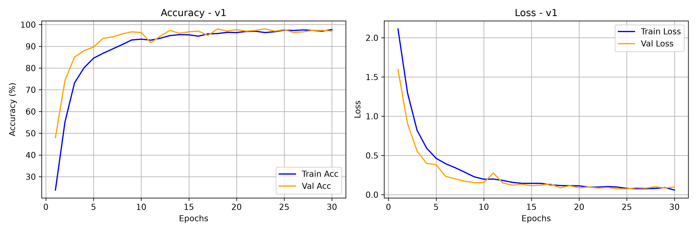
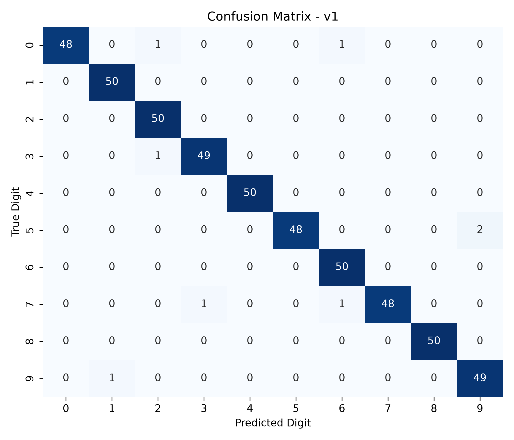

# Model Card — DigitSense v1.0

| Field | Value |
| :--- | :--- |
| Version | v1.0 (baseline) |
| Git tag | [V1.0.0](https://github.com/Hades-Highness/spoken-digit-recognition/releases/tag/V1.0.0) |
| Checkpoint | `models/digitsense_v1.0.pth` — 633,938 bytes |
| Status | Historical baseline, superseded by [v4.0](model_card_v4.0.md) |
| Task | Spoken digit classification, 10 classes (0–9), English |
| Dataset | FSDD only — 3,000 clips, 6 speakers, 8 kHz |
| Split | Naive random 80/20; **all 6 speakers appear in train, val and test** |
| Sample rate | 8 kHz |
| Input features | 1-channel log-mel |
| Epochs trained | 30 (counted in `history_v1.json`) |
| Best validation accuracy | **98.0 %** (epochs 18 and 23) |
| Test accuracy | **98.40 %** — 500 clips, same-speaker distribution |
| Test accuracy, 5 unseen speakers | 66.5 % [†](#note-on-the-5-unseen-speakers-column) |
| Artifacts | `models_data/model_v1/` |

## Why this version exists

v1.0 is the reference point for the whole project: a small CNN trained on FSDD with the
obvious split. It is the version that produced a high number for the wrong reason, and every
later version exists because of what this one hid.

## Configuration

Not recorded in the repository. `history_v1.json` stores only the four metric arrays, so the
optimizer, learning rate, augmentation set and batch size used for v1.0 are not machine-verifiable
from this checkout. What is known from the project history:

- 3,000 FSDD clips, 8 kHz, split 2,000 train / 500 val / 500 test by random draw.
- 1-channel log-mel input.
- 30 epochs.

## Results

| Metric | Value |
| :--- | :--- |
| Best validation accuracy | 98.0 % (epochs 18, 23) |
| Final epoch (30) train / val accuracy | 97.71 % / 97.00 % |
| Final train / val loss | 0.0593 / 0.0982 |
| Lowest validation loss | 0.0735 (epoch 25) |
| Test accuracy (500 clips) | 98.40 % |
| Macro-average F1 | 0.9844 |

### Classification report (verbatim, `report_v1.txt`)

| Digit | Precision | Recall | F1 | Support |
| :---: | :---: | :---: | :---: | :---: |
| 0 | 1.0000 | 0.9600 | 0.9796 | 50 |
| 1 | 0.9804 | 1.0000 | 0.9901 | 50 |
| 2 | 0.9615 | 1.0000 | 0.9804 | 50 |
| 3 | 0.9800 | 0.9800 | 0.9800 | 50 |
| 4 | 1.0000 | 1.0000 | 1.0000 | 50 |
| 5 | 1.0000 | 0.9600 | 0.9796 | 50 |
| 6 | 0.9615 | 1.0000 | 0.9804 | 50 |
| 7 | 1.0000 | 0.9600 | 0.9796 | 50 |
| 8 | 1.0000 | 1.0000 | 1.0000 | 50 |
| 9 | 0.9608 | 0.9800 | 0.9703 | 50 |
| **accuracy** | | | **0.9840** | **500** |
| macro avg | 0.9844 | 0.9840 | 0.9840 | 500 |

Every class sits above 0.96 recall, and no digit is systematically confused with another.
That uniform profile is itself the warning sign: when a model has seen the speaker, digit
recognition becomes nearly free.

### Training curves

Both curves climb together and validation loss keeps falling to the end of training. There is
no divergence to see here — because the validation clips come from the same six voices as the
training clips.

### Confusion matrix

## Interpretation

The 98.4 % test accuracy is real but narrow: it measures "recognising these six speakers'
digits", not "recognising digits". Re-evaluated on five speakers absent from training, the
same checkpoint scores 66.5 % — a 31.9-point drop. The gap is the speaker-identity leak that
the naive split creates, and it is the reason v2.0 changes the split before changing anything
else.

## Caveats and known issues

- The test set shares speakers with the training set, so this accuracy is not comparable to any
  later version's test accuracy.
- The README previously listed 98.2 % as the best validation accuracy; the committed
  `history_v1.json` peaks at 98.0 % (epochs 18 and 23). The value in this card follows the
  committed artifact.
- The checkpoint stores a 1-input-channel convolution (per the version table: 1-channel
  log-mel), while the current `model.py` builds `Conv2d(in_channels=3, ...)`. Loading it with
  today's architecture will fail. The stored tensor shapes could not be inspected here, so this
  is an inference from the recorded configuration, not a verified read of the file.

## Artifacts

| File | Content |
| :--- | :--- |
| `models_data/model_v1/report_v1.txt` | Per-class precision / recall / F1, accuracy 0.9840 |
| `models_data/model_v1/history_v1.json` | 30 epochs of train/val accuracy and loss |
| `models_data/model_v1/curve_v1.png` | Accuracy and loss curves, 300 dpi |
| `models_data/model_v1/cm_v1.png` | 10×10 confusion matrix, 300 dpi |
| `models/digitsense_v1.0.pth` | Model weights |