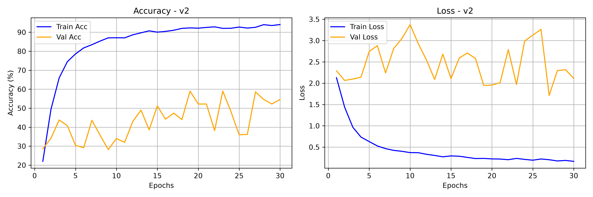
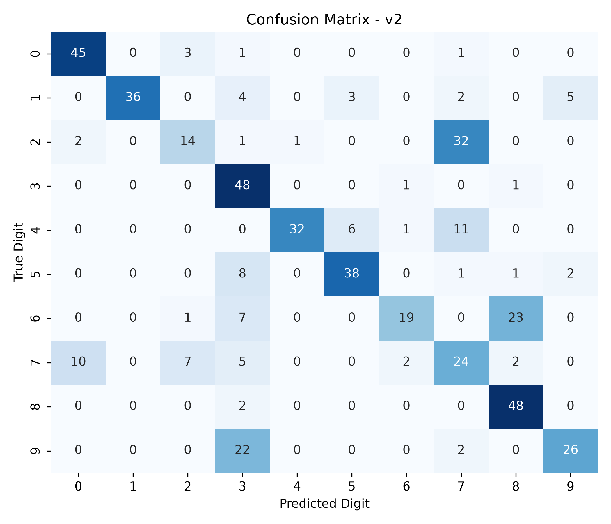

# Model Card — DigitSense v2.0

| Field | Value |
| :--- | :--- |
| Version | v2.0 (speaker-independent split) |
| Git tag | [V2.0.0](https://github.com/Hades-Highness/spoken-digit-recognition/releases/tag/V2.0.0) |
| Checkpoint | `models/digitsense_v2.0.pth` — 633,938 bytes |
| Status | Historical, superseded by [v4.0](model_card_v4.0.md) |
| Task | Spoken digit classification, 10 classes (0–9), English |
| Dataset | FSDD only — 3,000 clips, 6 speakers, 8 kHz |
| Split | Speaker-independent: train 4 speakers, val `lucas`, test `george` |
| Sample rate | 8 kHz |
| Input features | 1-channel log-mel |
| Epochs trained | 30 (counted in `history_v2.json`) |
| Best validation accuracy | **59.0 %** (epochs 19 and 23) |
| Test accuracy | **66.00 %** — 500 clips from the unseen speaker `george` |
| Test accuracy, 5 unseen speakers | 54.3 % [†](#note-on-the-5-unseen-speakers-column) |
| Artifacts | `models_data/model_v2/` |

## Why this version exists

v2.0 is the honest baseline. The only change from [v1.0](model_card_v1.0.md) is the split:
training clips come from four speakers (`jackson`, `nicolas`, `theo`, `yweweler`), validation
from a fifth (`lucas`) and test from a sixth (`george`). Nothing about the model, the features
or the optimizer changed. The accuracy drop from 98.4 % to 66.0 % therefore measures the size
of the leak, not a regression in the model.

## Configuration

Not recorded in the repository — `history_v2.json` stores only the four metric arrays. Known
from the project history:

- FSDD, 8 kHz, train 2,000 / val 500 / test 500, separated by speaker.
- 1-channel log-mel input.
- 30 epochs.

## Results

| Metric | Value |
| :--- | :--- |
| Best validation accuracy | 59.0 % (epochs 19, 23) |
| Final epoch (30) train / val accuracy | 94.05 % / 54.60 % |
| Final train / val loss | 0.1660 / 2.1149 |
| Highest validation loss | 3.3756 (epoch 10) |
| Test accuracy (500 clips, unseen speaker) | 66.00 % |
| Macro-average F1 | 0.7200 |

### Classification report (verbatim, `report_v2.txt`)

| Digit | Precision | Recall | F1 | Support |
| :---: | :---: | :---: | :---: | :---: |
| 0 | 0.7895 | 0.9000 | 0.8411 | 50 |
| 1 | 1.0000 | 0.7200 | 0.8372 | 50 |
| 2 | 0.5600 | 0.2800 | 0.3733 | 50 |
| 3 | 0.4898 | 0.9600 | 0.6486 | 50 |
| 4 | 0.9697 | 0.6400 | 0.7711 | 50 |
| 5 | 0.8085 | 0.7600 | 0.7835 | 50 |
| 6 | 0.8261 | 0.3800 | 0.5205 | 50 |
| 7 | 0.3288 | 0.4800 | 0.3902 | 50 |
| 8 | 0.6400 | 0.9600 | 0.7680 | 50 |
| 9 | 0.7879 | 0.5200 | 0.6265 | 50 |
| **accuracy** | | | **0.6600** | **500** |
| macro avg | 0.7200 | 0.6600 | 0.6560 | 500 |

The profile is no longer uniform. Digit 3 is recalled at 0.96 but with 0.49 precision — it acts
as a catch-all. Digit 8 has 0.96 recall at 0.64 precision, digit 2 collapses to 0.28 recall.
Precision and recall disagree, which is what happens when the model latches onto acoustic
correlates of the training voices instead of phoneme content.

### Training curves

This is the clearest single plot in the repository. Training accuracy climbs to 94 % while
validation oscillates between 28 % and 59 %, and validation loss *rises* from 2.29 to 3.38
before settling near 2.1 — while training loss falls to 0.17. That divergence is textbook
overfitting to speaker identity.

### Confusion matrix

## Interpretation

Four training speakers, all male, are not enough for the network to learn pitch-invariant digit
features. It fits the four voices and treats the fifth as out-of-distribution. Every subsequent
version is an attempt to widen the acoustic distribution: v2.1 adds perturbations, v2.2 adds
architectural invariance, v3.0 finally adds speakers.

## Caveats and known issues

- Single-speaker validation and test sets (500 clips each) make every metric here high-variance;
  a one-speaker estimate is a noisy proxy for generalisation.
- The README previously listed 59.4 % as the best validation accuracy; `history_v2.json` peaks
  at 59.0 %. The value in this card follows the committed artifact.
- 1-input-channel checkpoint, not loadable with the current `model.py`
  (`Conv2d(in_channels=3, ...)`) — see the note in [v1.0](model_card_v1.0.md#caveats-and-known-issues).

## Artifacts

| File | Content |
| :--- | :--- |
| `models_data/model_v2/report_v2.txt` | Per-class precision / recall / F1, accuracy 0.6600 |
| `models_data/model_v2/history_v2.json` | 30 epochs of train/val accuracy and loss |
| `models_data/model_v2/curve_v2.png` | Accuracy and loss curves, 300 dpi |
| `models_data/model_v2/cm_v2.png` | 10×10 confusion matrix, 300 dpi |
| `models/digitsense_v2.0.pth` | Model weights |

