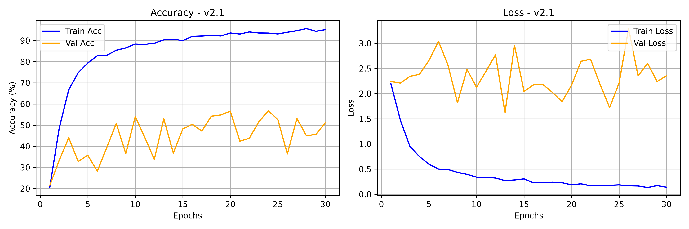
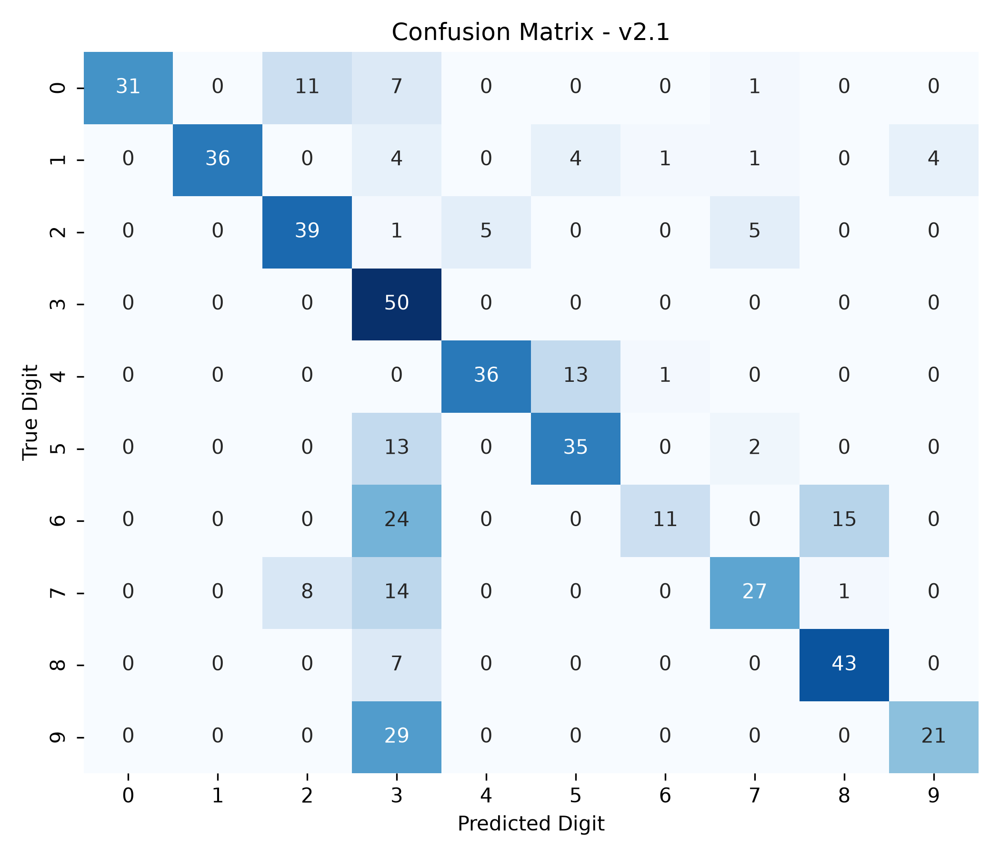

# Model Card — DigitSense v2.1

| Field | Value |
| :--- | :--- |
| Version | v2.1 (acoustic perturbations) |
| Git tag | [V2.1.0](https://github.com/Hades-Highness/spoken-digit-recognition/releases/tag/V2.1.0) |
| Checkpoint | `models/digitsense_v2.1.pth` — 634,064 bytes |
| Status | Historical, superseded by [v4.0](model_card_v4.0.md) |
| Task | Spoken digit classification, 10 classes (0–9), English |
| Dataset | FSDD only — 3,000 clips, 6 speakers, 8 kHz |
| Split | Speaker-independent, identical to [v2.0](model_card_v2.0.md) |
| Sample rate | 8 kHz |
| Input features | 1-channel log-mel |
| Epochs trained | 30 (counted in `history_v2.1.json`) |
| Best validation accuracy | **56.8 %** (epoch 24) |
| Test accuracy | **65.80 %** — 500 clips from the unseen speaker `george` |
| Test accuracy, 5 unseen speakers | 48.0 % [†](#note-on-the-5-unseen-speakers-column) — the lowest of any version |
| Artifacts | `models_data/model_v2.1/` |

## Why this version exists

v2.1 asks whether data augmentation can substitute for speaker diversity. With the v2.0 split
unchanged, it adds low-level Gaussian noise and SpecAugment-style frequency and time masking to
the four training speakers, hoping to widen the acoustic distribution artificially.

## Configuration

Not recorded in the repository — `history_v2.1.json` stores only the four metric arrays. Known
from the project history:

- Same speaker-independent split as v2.0.
- Additive white noise (reported at 20 % probability).
- SpecAugment: frequency masking and time masking.
- 30 epochs.

## Results

| Metric | Value |
| :--- | :--- |
| Best validation accuracy | 56.8 % (epoch 24) |
| Final epoch (30) train / val accuracy | 95.15 % / 51.20 % |
| Final train / val loss | 0.1388 / 2.3567 |
| Highest validation loss | 3.2918 (epoch 26) |
| Test accuracy (500 clips, unseen speaker) | 65.80 % |
| Macro-average F1 | 0.7724 |

### Classification report (verbatim, `report_v2.1.txt`)

| Digit | Precision | Recall | F1 | Support |
| :---: | :---: | :---: | :---: | :---: |
| 0 | 1.0000 | 0.6200 | 0.7654 | 50 |
| 1 | 1.0000 | 0.7200 | 0.8372 | 50 |
| 2 | 0.6724 | 0.7800 | 0.7222 | 50 |
| 3 | 0.3356 | 1.0000 | 0.5025 | 50 |
| 4 | 0.8780 | 0.7200 | 0.7912 | 50 |
| 5 | 0.6731 | 0.7000 | 0.6863 | 50 |
| 6 | 0.8462 | 0.2200 | 0.3492 | 50 |
| 7 | 0.7500 | 0.5400 | 0.6279 | 50 |
| 8 | 0.7288 | 0.8600 | 0.7890 | 50 |
| 9 | 0.8400 | 0.4200 | 0.5600 | 50 |
| **accuracy** | | | **0.6580** | **500** |
| macro avg | 0.7724 | 0.6580 | 0.6631 | 500 |

Digit 3 now absorbs everything: recall 1.00 with precision 0.34. Digit 6 drops to 0.22 recall,
digit 9 to 0.42. The masking pushed the model towards a broader but less discriminative decision
boundary.

### Training curves

Validation accuracy bounces between 21 % and 57 % for all 30 epochs and never settles. Validation
loss stays above 2.1 throughout, with spikes to 3.29. Training accuracy reaches 95 %, so the
capacity is there — the signal to learn from is not.

### Confusion matrix

## Interpretation

This is the negative result the project needed. On four male speakers, augmentation adds
variation the model can already fit but no new speaker information; the cross-version benchmark
actually drops from 54.3 % (v2.0) to 48.0 % (v2.1). Aggressive masking on a narrow acoustic base
removes more usable signal than it prevents overfitting. The conclusion — speaker diversity is a
data problem, not an augmentation problem — is what motivates v3.0.

## Caveats and known issues

- The README previously listed 54.0 % as the best validation accuracy; `history_v2.1.json` peaks
  at 56.8 % (epoch 24), while 54.0 % occurs at epoch 10. The value in this card follows the
  committed artifact.
- Single-speaker validation and test sets make these metrics high-variance.
- 1-input-channel checkpoint, not loadable with the current `model.py` — see the note in
  [v1.0](model_card_v1.0.md#caveats-and-known-issues).
- Augmentation probabilities and mask widths for this version are not recorded in the repository;
  the values in the README describe the pipeline, not this checkpoint's exact run.

## Artifacts

| File | Content |
| :--- | :--- |
| `models_data/model_v2.1/report_v2.1.txt` | Per-class precision / recall / F1, accuracy 0.6580 |
| `models_data/model_v2.1/history_v2.1.json` | 30 epochs of train/val accuracy and loss |
| `models_data/model_v2.1/curve_v2.1.png` | Accuracy and loss curves, 300 dpi |
| `models_data/model_v2.1/cm_v2.1.png` | 10×10 confusion matrix, 300 dpi |
| `models/digitsense_v2.1.pth` | Model weights |
