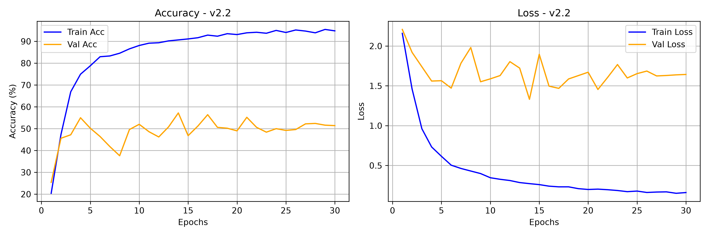
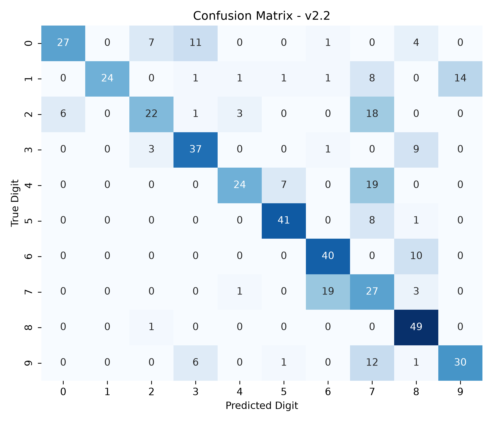

# Model Card — DigitSense v2.2

| Field | Value |
| :--- | :--- |
| Version | v2.2 (speaker invariance in the architecture) |
| Git tag | [V2.2.0](https://github.com/Hades-Highness/spoken-digit-recognition/releases/tag/V2.2.0) |
| Checkpoint | `models/digitsense_v2.2.pth` — 630,499 bytes |
| Status | Historical, superseded by [v4.0](model_card_v4.0.md); its invariance choices survive into v4.0 |
| Task | Spoken digit classification, 10 classes (0–9), English |
| Dataset | FSDD only — 3,000 clips, 6 speakers, 8 kHz |
| Split | Speaker-independent, identical to [v2.0](model_card_v2.0.md) |
| Sample rate | 8 kHz |
| Input features | 1-channel log-mel |
| Epochs trained | 30 (counted in `history_v2.2.json`) |
| Best validation accuracy | **57.2 %** (epoch 14) |
| Test accuracy | **64.20 %** — 500 clips from the unseen speaker `george` |
| Test accuracy, 5 unseen speakers | 57.1 % [†](#note-on-the-5-unseen-speakers-column) |
| Artifacts | `models_data/model_v2.2/` |

## Why this version exists

v2.2 attacks speaker identity at the architecture level instead of the data level. Four changes
were introduced together, with the split unchanged from v2.0:

1. **Per-sample instance standardization** — zero-mean, unit-variance scaling of each spectrogram,
   $X_{norm} = (X - \mu)/(\sigma + \epsilon)$, removing per-utterance gain and offset.
2. **`InstanceNorm2d` instead of `BatchNorm2d`** in the convolutional stack, so normalization
   statistics are computed per sample rather than per batch.
3. **Stronger regularization** — dropout 0.4, weight decay $10^{-4}$, cosine annealing schedule.
4. Same augmentation budget as v2.1.

## Configuration

Not recorded in the repository — `history_v2.2.json` stores only the four metric arrays. The four
changes above come from the project history and match the architecture still present in
`model.py`.

## Results

| Metric | Value |
| :--- | :--- |
| Best validation accuracy | 57.2 % (epoch 14) |
| Final epoch (30) train / val accuracy | 94.80 % / 51.40 % |
| Final train / val loss | 0.1602 / 1.6428 |
| Highest validation loss | 1.9809 (epoch 8) |
| Test accuracy (500 clips, unseen speaker) | 64.20 % |
| Macro-average F1 | 0.7050 |

### Classification report (verbatim, `report_v2.2.txt`)

| Digit | Precision | Recall | F1 | Support |
| :---: | :---: | :---: | :---: | :---: |
| 0 | 0.8182 | 0.5400 | 0.6506 | 50 |
| 1 | 1.0000 | 0.4800 | 0.6486 | 50 |
| 2 | 0.6667 | 0.4400 | 0.5301 | 50 |
| 3 | 0.6607 | 0.7400 | 0.6981 | 50 |
| 4 | 0.8276 | 0.4800 | 0.6076 | 50 |
| 5 | 0.8200 | 0.8200 | 0.8200 | 50 |
| 6 | 0.6452 | 0.8000 | 0.7143 | 50 |
| 7 | 0.2935 | 0.5400 | 0.3803 | 50 |
| 8 | 0.6364 | 0.9800 | 0.7717 | 50 |
| 9 | 0.6818 | 0.6000 | 0.6383 | 50 |
| **accuracy** | | | **0.6420** | **500** |
| macro avg | 0.7050 | 0.6420 | 0.6460 | 500 |

Digit 7 is the clearest failure: 0.54 recall at 0.29 precision, so it is over-predicted roughly
twice for every correct call. Digit 8 keeps the v2.0 pattern of very high recall (0.98) at
mediocre precision (0.64).

### Training curves

Compare this loss panel with [v2.0](model_card_v2.0.md) and [v2.1](model_card_v2.1.md): validation
loss falls from 2.21 to 1.64 with a peak of 1.98 instead of ~3.3, and the curve is smooth rather
than oscillating. The regularization worked. Validation accuracy, however, stays in the same
46–57 % band and peaks at 57.2 %.

### Confusion matrix

## Interpretation

v2.2 is the version that isolates the bottleneck. It fixes the training dynamics — a stable
validation loss and no divergence — without moving accuracy, which stays at the v2.0 ceiling of
about 57 %. Removing speaker style architecturally cannot help when the training set contains
only four voices to begin with; there is no pitch-invariant structure to extract. That result
is why v3.0 changes the data rather than the model, and why `InstanceNorm2d` plus per-sample
standardization are kept in v4.0.

## Caveats and known issues

- `history_v2.2.json` is the first history whose best validation accuracy (57.2 %) matches the
  value reported in the README.
- The checkpoint is ~3.5 KB smaller than v2.1's; this is consistent with removing batch-norm
  running statistics, but the stored tensors were not inspected here, so the mechanism is an
  inference rather than a verified fact.
- Single-speaker validation and test sets make these metrics high-variance.
- 1-input-channel checkpoint, not loadable with the current `model.py` — see the note in
  [v1.0](model_card_v1.0.md#caveats-and-known-issues).

## Artifacts

| File | Content |
| :--- | :--- |
| `models_data/model_v2.2/report_v2.2.txt` | Per-class precision / recall / F1, accuracy 0.6420 |
| `models_data/model_v2.2/history_v2.2.json` | 30 epochs of train/val accuracy and loss |
| `models_data/model_v2.2/curve_v2.2.png` | Accuracy and loss curves, 300 dpi |
| `models_data/model_v2.2/cm_v2.2.png` | 10×10 confusion matrix, 300 dpi |
| `models/digitsense_v2.2.pth` | Model weights |
