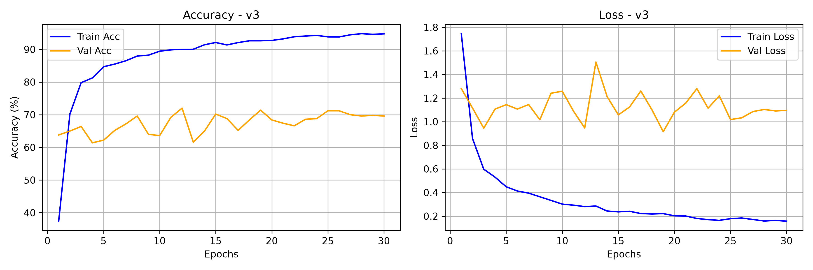
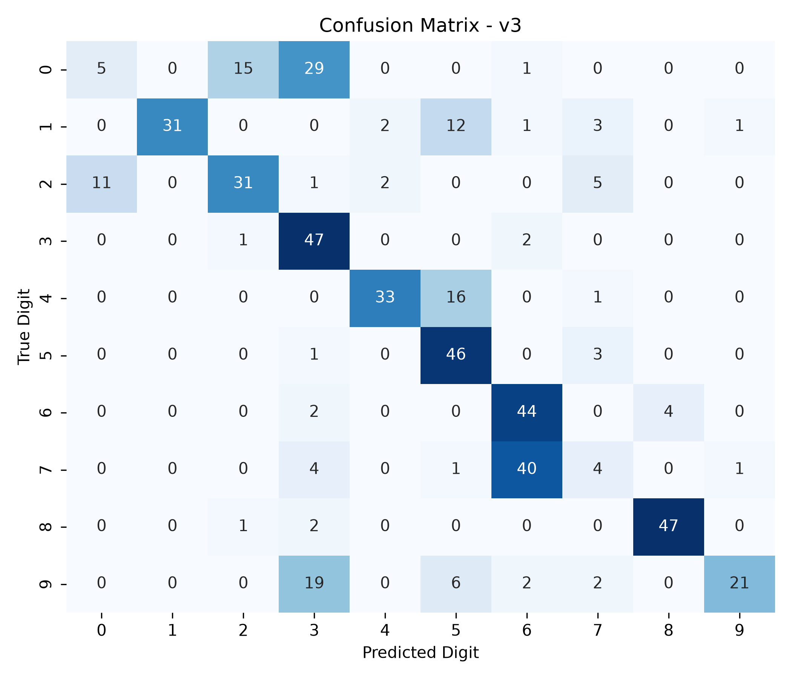

# Model Card — DigitSense v3.0

| Field | Value |
| :--- | :--- |
| Version | v3.0 (dataset expansion and gender balancing) |
| Git tag | [V3.0.0](https://github.com/Hades-Highness/spoken-digit-recognition/releases/tag/V3.0.0) |
| Checkpoint | `models/digitsense_v3.0.pth` — 630,455 bytes |
| Status | Historical, superseded by [v4.0](model_card_v4.0.md) |
| Task | Spoken digit classification, 10 classes (0–9), English |
| Dataset | FSDD + AudioMNIST — 5,000 clips, 8 speakers |
| Split | Train: 4 FSDD male + 4 AudioMNIST female; val `lucas`; test `george` |
| Sample rate | 8 kHz |
| Input features | 1-channel log-mel |
| Epochs trained | 30 (counted in `history_v3.json`) |
| Best validation accuracy | **72.0 %** (epoch 12) |
| Test accuracy | **61.80 %** — 500 clips from the unseen speaker `george` |
| Test accuracy, 5 unseen speakers | 75.9 % [†](#note-on-the-5-unseen-speakers-column) |
| Artifacts | `models_data/model_v3/` |

## Why this version exists

This is the first version that acts on the diagnosis from [v2.2](model_card_v2.2.md): the model
does not lack capacity or regularization, it lacks voices. Two thousand clips from four female
AudioMNIST speakers (`12`, `26`, `28`, `47`) were added to the four male FSDD speakers, giving
eight training speakers, a 50/50 gender balance and a wider fundamental-frequency range.

## Configuration

Not recorded in the repository — `history_v3.json` stores only the four metric arrays. Known
from the project history:

- Train: 2,000 FSDD clips (4 male speakers) + 2,000 AudioMNIST clips (4 female speakers).
- Validation: 500 FSDD clips from `lucas`. Test: 500 FSDD clips from `george`.
- 1-channel log-mel input, 8 kHz.
- 30 epochs.

## Results

| Metric | Value |
| :--- | :--- |
| Best validation accuracy | 72.0 % (epoch 12) |
| Final epoch (30) train / val accuracy | 94.75 % / 69.60 % |
| Final train / val loss | 0.1576 / 1.0952 |
| Highest validation loss | 1.5050 (epoch 13) |
| Test accuracy (500 clips, unseen speaker) | 61.80 % |
| Macro-average F1 | 0.6411 |

### Classification report (verbatim, `report_v3.txt`)

| Digit | Precision | Recall | F1 | Support |
| :---: | :---: | :---: | :---: | :---: |
| 0 | 0.3125 | 0.1000 | 0.1515 | 50 |
| 1 | 1.0000 | 0.6200 | 0.7654 | 50 |
| 2 | 0.6458 | 0.6200 | 0.6327 | 50 |
| 3 | 0.4476 | 0.9400 | 0.6065 | 50 |
| 4 | 0.8919 | 0.6600 | 0.7586 | 50 |
| 5 | 0.5679 | 0.9200 | 0.7023 | 50 |
| 6 | 0.4889 | 0.8800 | 0.6286 | 50 |
| 7 | 0.2222 | 0.0800 | 0.1176 | 50 |
| 8 | 0.9216 | 0.9400 | 0.9307 | 50 |
| 9 | 0.9130 | 0.4200 | 0.5753 | 50 |
| **accuracy** | | | **0.6180** | **500** |
| macro avg | 0.6411 | 0.6180 | 0.5869 | 500 |

Digits 0 and 7 nearly collapse on this test speaker: recall 0.10 and 0.08. The model that
generalises better across five speakers is worse on this one.

### Training curves

Validation accuracy jumps immediately — 63.8 % at epoch 1, against 25–28 % for
[v2.0](model_card_v2.0.md) — and stabilises in the 61–72 % band with a much lower validation loss
(1.28 at the start, 1.10 at the end, peak 1.51). More speakers produce a better-behaved
optimisation problem, not just a better number.

### Confusion matrix

## Interpretation

Two protocols disagree about this version, and the disagreement is informative. On the
single-speaker `george` test set, v3.0 scores 61.8 % — *worse* than v2.2's 64.2 %. On the fixed
five-speaker benchmark it scores 75.9 %, up from 57.1 %. The five-speaker number is the credible
one: a single unseen speaker is a high-variance estimator, and `george` happens to contain the
digit-0 and digit-7 utterances this model fails on. The +18.8-point benchmark gain makes speaker
diversity by far the largest single improvement in the project.

## Caveats and known issues

- The README previously listed 73.2 % as the best validation accuracy; `history_v3.json` peaks at
  72.0 % (epoch 12). The value in this card follows the committed artifact.
- **Possible benchmark contamination.** v3.0 trained on AudioMNIST speakers `12`, `26`, `28` and
  `47`. The v4.0 split in `dataset.py` assigns `28` and `47` to the *test* set and `12`, `26` to
  validation. If the cross-version benchmark used those speakers, v3.0's benchmark score is
  inflated because it saw two of them during training. The README lists a different benchmark
  speaker set (`01, 02, 07, 03, 04`), which itself conflicts with `dataset.py`. The benchmark
  needs to be re-run from a committed script before these numbers can be trusted.
- 1-input-channel checkpoint, not loadable with the current `model.py` — see the note in
  [v1.0](model_card_v1.0.md#caveats-and-known-issues).
- The 4:1 FSDD-to-AudioMNIST imbalance across two different recording setups was not corrected
  here (no per-source normalization); the mixture effect is not separately measured.

## Artifacts

| File | Content |
| :--- | :--- |
| `models_data/model_v3/report_v3.txt` | Per-class precision / recall / F1, accuracy 0.6180 |
| `models_data/model_v3/history_v3.json` | 30 epochs of train/val accuracy and loss |
| `models_data/model_v3/curve_v3.png` | Accuracy and loss curves, 300 dpi |
| `models_data/model_v3/cm_v3.png` | 10×10 confusion matrix, 300 dpi |
| `models/digitsense_v3.0.pth` | Model weights |
