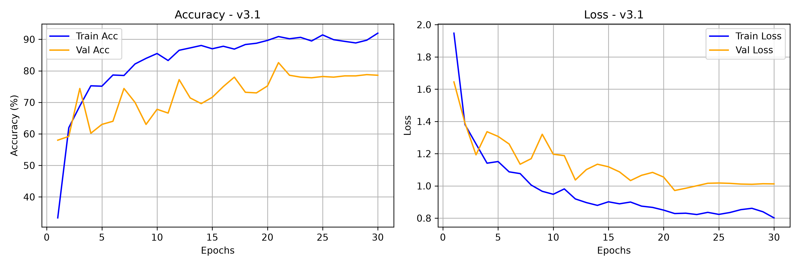
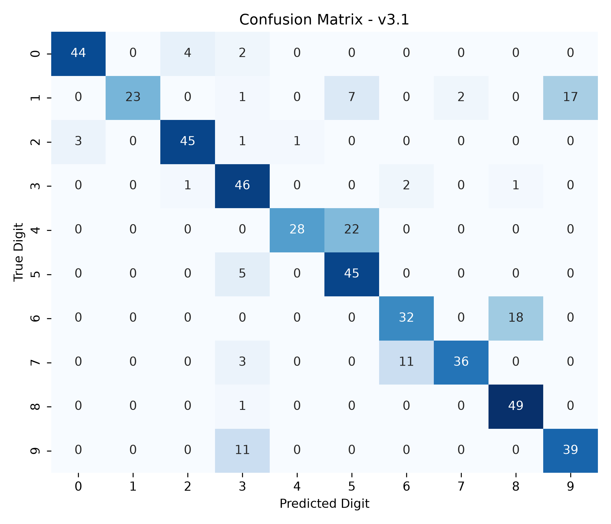

# Model Card — DigitSense v3.1

| Field | Value |
| :--- | :--- |
| Version | v3.1 (GPU augmentation pipeline and label smoothing) |
| Git tag | [V3.1.0](https://github.com/Hades-Highness/spoken-digit-recognition/releases/tag/V3.1.0) |
| Checkpoint | `models/digitsense_v3.1.pth` — 630,499 bytes (plus `digitsense_v3.1.onnx` in the release) |
| Status | Historical, superseded by [v4.0](model_card_v4.0.md) |
| Task | Spoken digit classification, 10 classes (0–9), English |
| Dataset | FSDD + AudioMNIST — 5,000 clips, 8 speakers (same as [v3.0](model_card_v3.0.md)) |
| Split | Train: 4 FSDD male + 4 AudioMNIST female; val `lucas`; test `george` |
| Sample rate | 8 kHz |
| Input features | 1-channel log-mel |
| Epochs trained | 30 (counted in `history_v3.1.json`) |
| Best validation accuracy | **82.6 %** (epoch 21) |
| Test accuracy | **77.40 %** — 500 clips from the unseen speaker `george` |
| Test accuracy, 5 unseen speakers | 89.5 % [†](#note-on-the-5-unseen-speakers-column) |
| Artifacts | `models_data/model_v3.1/` |

## Why this version exists

With the speaker base fixed by [v3.0](model_card_v3.0.md), v3.1 improves how the training signal
is produced and regularised:

1. **GPU-resident feature extraction** — mel-spectrogram computation and all acoustic
   transformations moved onto the GPU inside the training loop, removing the CPU bottleneck.
2. **On-the-fly GPU augmentations** — pitch shifting (±2 semitones), circular time shifting
   (±100 ms) and SpecAugment, applied per batch.
3. **Label smoothing** (`CrossEntropyLoss(label_smoothing=0.1)`) to penalise overconfident
   predictions between acoustically close digits.

## Configuration

Not recorded in the repository — `history_v3.1.json` stores only the four metric arrays. The
augmentation probabilities and mask widths quoted in the main README describe the pipeline that
this version introduced; they are not verifiable per-run from this checkout.

## Results

| Metric | Value |
| :--- | :--- |
| Best validation accuracy | 82.6 % (epoch 21) |
| Final epoch (30) train / val accuracy | 91.95 % / 78.60 % |
| Final train / val loss | 0.8017 / 1.0125 |
| Highest validation loss | 1.6450 (epoch 1) |
| Test accuracy (500 clips, unseen speaker) | 77.40 % |
| Macro-average F1 | 0.8142 |

### Classification report (verbatim, `report_v3.1.txt`)

| Digit | Precision | Recall | F1 | Support |
| :---: | :---: | :---: | :---: | :---: |
| 0 | 0.9362 | 0.8800 | 0.9072 | 50 |
| 1 | 1.0000 | 0.4600 | 0.6301 | 50 |
| 2 | 0.9000 | 0.9000 | 0.9000 | 50 |
| 3 | 0.6571 | 0.9200 | 0.7667 | 50 |
| 4 | 0.9655 | 0.5600 | 0.7089 | 50 |
| 5 | 0.6081 | 0.9000 | 0.7258 | 50 |
| 6 | 0.7111 | 0.6400 | 0.6737 | 50 |
| 7 | 0.9474 | 0.7200 | 0.8182 | 50 |
| 8 | 0.7206 | 0.9800 | 0.8305 | 50 |
| 9 | 0.6964 | 0.7800 | 0.7358 | 50 |
| **accuracy** | | | **0.7740** | **500** |
| macro avg | 0.8142 | 0.7740 | 0.7697 | 500 |

The catastrophic digits of v3.0 are repaired: digit 0 goes from 0.10 to 0.88 recall and digit 7
from 0.08 to 0.72. The remaining weakness moves to digit 1 (0.46 recall at 1.00 precision) and
digit 4 (0.56 at 0.97) — both under-recalled, not over-predicted.

### Training curves

Validation accuracy climbs steadily from 58 % to a peak of 82.6 % at epoch 21 and settles near
78.6 %, with validation loss falling from 1.65 to 1.01 and staying flat thereafter. The gap
between train (92 %) and validation (79 %) is smaller than in v3.0 (94.8 % vs 69.6 %), which is
what the added augmentation and label smoothing were meant to achieve.

### Confusion matrix

## Interpretation

v3.1 shows that augmentation works once the data is diverse enough to support it. The same
augmentation family that *hurt* on four male FSDD speakers in
[v2.1](model_card_v2.1.md) (benchmark 48.0 %) now adds +13.6 points over v3.0 (75.9 % → 89.5 %).
The lesson from v2.1 was not "augmentation is useless" but "augmentation cannot substitute for
speaker diversity" — this version is the control that demonstrates it.

## Caveats and known issues

- The README listed 82.5 % as the best validation accuracy; `history_v3.1.json` peaks at 82.6 %
  (epoch 21). The value in this card follows the committed artifact.
- Same possible benchmark contamination as [v3.0](model_card_v3.0.md#caveats-and-known-issues):
  this version also trained on AudioMNIST speakers `12`, `26`, `28`, `47`.
- 1-input-channel checkpoint, not loadable with the current `model.py` — see the note in
  [v1.0](model_card_v1.0.md#caveats-and-known-issues).
- Epoch-to-epoch variance remains visible in the curves; the reported best value is a single run,
  not an average over seeds.

## Artifacts

| File | Content |
| :--- | :--- |
| `models_data/model_v3.1/report_v3.1.txt` | Per-class precision / recall / F1, accuracy 0.7740 |
| `models_data/model_v3.1/history_v3.1.json` | 30 epochs of train/val accuracy and loss |
| `models_data/model_v3.1/curve_v3.1.png` | Accuracy and loss curves, 300 dpi |
| `models_data/model_v3.1/cm_v3.1.png` | 10×10 confusion matrix, 300 dpi |
| `models/digitsense_v3.1.pth` | Model weights |
| `digitsense_v3.1.onnx` (release asset) | ONNX export |
