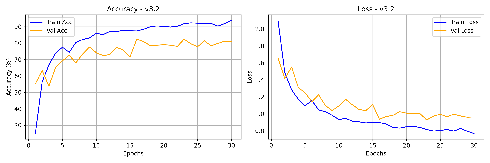
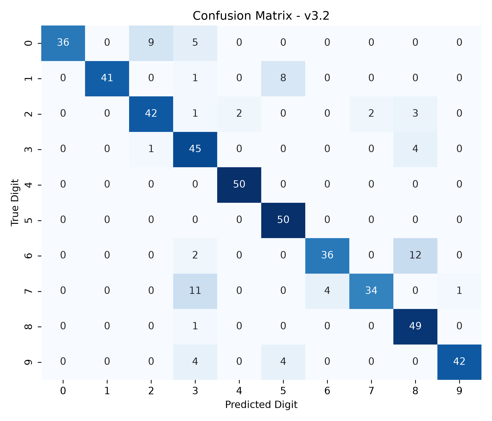

# Model Card — DigitSense v3.2

| Field | Value |
| :--- | :--- |
| Version | v3.2 (3-channel spectral input, doubled temporal resolution) |
| Git tag | [V3.2.0](https://github.com/Hades-Highness/spoken-digit-recognition/releases/tag/V3.2.0) |
| Checkpoint | `models/digitsense_v3.2.pth` — 631,651 bytes (plus `digitsense_v3.2.onnx` in the release) |
| Status | Historical; its feature representation is reused at 16 kHz by [v4.0](model_card_v4.0.md) |
| Task | Spoken digit classification, 10 classes (0–9), English |
| Dataset | FSDD + AudioMNIST — 5,000 clips, 8 speakers |
| Split | Train: 4 FSDD male + 4 AudioMNIST female; val `lucas`; test `george` |
| Sample rate | 8 kHz |
| Input features | 3-channel: log-mel + Δ + Δ², `hop_length=128` (~63 frames) |
| Epochs trained | 30 (counted in `history_v3.2.json`) |
| Best validation accuracy | **82.4 %** (epochs 16 and 23) |
| Test accuracy | **85.00 %** (425/500) — unseen speaker `george` |
| Test accuracy, 5 unseen speakers | 95.4 % [†](#note-on-the-5-unseen-speakers-column) |
| Artifacts | `models_data/model_v3.2/` |

## Why this version exists

v3.1's remaining errors concentrate on under-recalled digits — pairs whose difference lives in
the consonant transition rather than in the steady vowel. v3.2 changes the input representation
to make those dynamics explicit:

1. **Doubled temporal resolution** — `hop_length` reduced from 256 to 128 at 8 kHz, giving ~63
   frames per second of audio instead of ~32, to capture sharp attack transients.
2. **3-channel spectral input** — log-mel, first derivative (Δ, spectral velocity) and second
   derivative (Δ², spectral acceleration) stacked as `[batch, 3, 64, 63]`.

## Configuration

Not recorded in the repository — `history_v3.2.json` stores only the four metric arrays. The
feature definition above is the one still implemented in `train.py` and `preprocessing.py`; the
8 kHz `hop_length=128` setting of this version is not preserved in the current code, which runs
at 16 kHz with `hop_length=256` and the same 63-frame output shape.

## Results

| Metric | Value |
| :--- | :--- |
| Best validation accuracy | 82.4 % (epochs 16, 23) |
| Final epoch (30) train / val accuracy | 93.88 % / 81.20 % |
| Final train / val loss | 0.7687 / 0.9636 |
| Highest validation loss | 1.6585 (epoch 1) |
| Test accuracy (500 clips, unseen speaker) | 85.00 % (425/500) |
| Macro-average F1 | 0.8760 |

### Classification report (verbatim, `report_v3.2.txt`)

| Digit | Precision | Recall | F1 | Support |
| :---: | :---: | :---: | :---: | :---: |
| 0 | 1.0000 | 0.7200 | 0.8372 | 50 |
| 1 | 1.0000 | 0.8200 | 0.9011 | 50 |
| 2 | 0.8077 | 0.8400 | 0.8235 | 50 |
| 3 | 0.6429 | 0.9000 | 0.7500 | 50 |
| 4 | 0.9615 | 1.0000 | 0.9804 | 50 |
| 5 | 0.8065 | 1.0000 | 0.8929 | 50 |
| 6 | 0.9000 | 0.7200 | 0.8000 | 50 |
| 7 | 0.9444 | 0.6800 | 0.7907 | 50 |
| 8 | 0.7206 | 0.9800 | 0.8305 | 50 |
| 9 | 0.9767 | 0.8400 | 0.9032 | 50 |
| **accuracy** | | | **0.8500** | **500** |
| macro avg | 0.8760 | 0.8500 | 0.8510 | 500 |

Compared with [v3.1](model_card_v3.1.md), digit 1 recovers (0.46 → 0.82 recall) and digits 4 and
5 reach 1.00 recall. The remaining errors are concentrated in digit 0 (0.72 recall at 1.00
precision), digit 7 (0.68 at 0.94) and digit 6 (0.72 at 0.90) — under-recalled rather than
confused with each other.

### Training curves

Validation accuracy starts at 55 %, oscillates through the middle of training and stabilises
above 78 % from epoch 16 onward, peaking at 82.4 %. Validation loss falls from 1.66 to 0.96 and
stays below 1.0 for the last five epochs — the most stable loss curve of the 8 kHz versions.

### Confusion matrix

## Interpretation

Dynamic features and higher temporal resolution add +5.9 benchmark points (89.5 % → 95.4 %) and
+7.6 points on the single-speaker test (77.4 % → 85.0 %). The gain is largest exactly where the
representation predicts it should be: on digits distinguished by consonant transitions. This
representation is what v4.0 keeps, while raising the sample rate to 16 kHz.

## Caveats and known issues

- The README listed 82.4 % as the best validation accuracy, which matches `history_v3.2.json`
  (epochs 16 and 23).
- Same possible benchmark contamination as [v3.0](model_card_v3.0.md#caveats-and-known-issues).
- The checkpoint is byte-for-byte the same size as v4.0's (631,651 bytes), consistent with an
  identical architecture fed at two different sample rates. The stored tensors were not inspected
  here, so this is an inference from file size and the recorded configuration.
- Unlike v1.0–v3.1, this checkpoint has 3 input channels and *is* loadable by the current
  `model.py`. Re-evaluating it needs the 8 kHz feature pipeline, which is not in the repository.
- Epoch-to-epoch variance is high in the middle of training; the reported values are single-run.

## Artifacts

| File | Content |
| :--- | :--- |
| `models_data/model_v3.2/report_v3.2.txt` | Per-class precision / recall / F1, accuracy 0.8500 |
| `models_data/model_v3.2/history_v3.2.json` | 30 epochs of train/val accuracy and loss |
| `models_data/model_v3.2/curve_v3.2.png` | Accuracy and loss curves, 300 dpi |
| `models_data/model_v3.2/cm_v3.2.png` | 10×10 confusion matrix, 300 dpi |
| `models/digitsense_v3.2.pth` | Model weights |
| `digitsense_v3.2.onnx` (release asset) | ONNX export |
