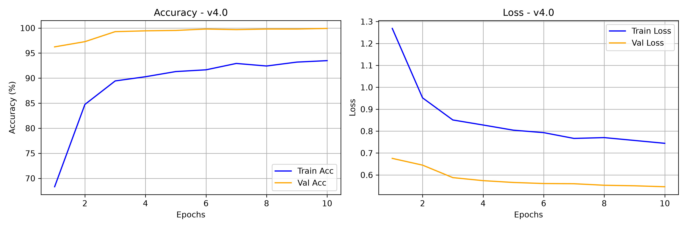
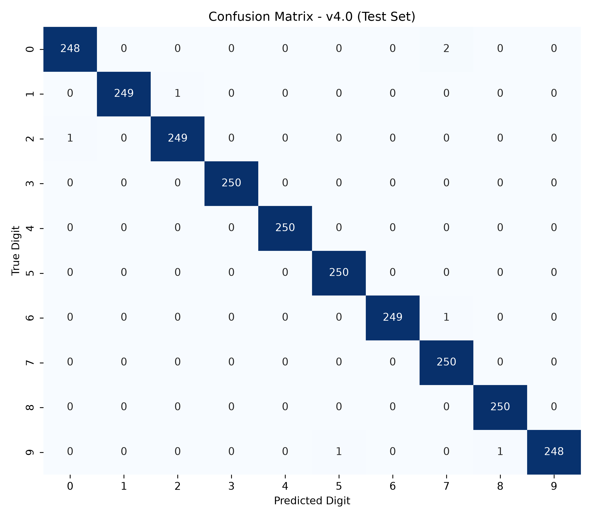

# Model Card — DigitSense v4.0

| Field | Value |
| :--- | :--- |
| Version | **v4.0 — current release** |
| Git tag | [V4.0.0](https://github.com/Hades-Highness/spoken-digit-recognition/releases/tag/V4.0.0) |
| Checkpoints | `models/digitsense_v4.0.pth` — 631,651 bytes; `digitsense_v4.0.onnx` — 649,114 bytes (release asset) |
| Status | Shipped. This is the model `app.py` and `inference.py` load |
| Task | Spoken digit classification, 10 classes (0–9), English |
| Dataset | AudioMNIST only — 60 speakers, 48 kHz source resampled to 16 kHz |
| Split | 50 training speakers / 5 validation (`03`, `04`, `05`, `12`, `26`) / 5 test (`01`, `02`, `07`, `28`, `47`) |
| Sample rate | 16 kHz |
| Input features | 3-channel: log-mel + Δ + Δ², `n_fft=1024`, `hop_length=256`, 63 frames |
| Epochs trained | 10 (counted in `history_v4.json`) |
| Best validation accuracy | **99.92 %** (epoch 10) |
| Test accuracy | **99.72 %** (2,493/2,500) on 5 unseen speakers |
| Artifacts | `models_data/model_v4/` |

## Why this version exists

v4.0 scales the two ingredients that the previous versions identified as decisive: acoustic
resolution and speaker diversity.

1. **16 kHz pipeline** — the sample rate is doubled from 8 kHz, with `n_fft=1024` and
   `hop_length=256`, keeping the 63-frame output shape of [v3.2](model_card_v3.2.md) while
   capturing higher-frequency formant detail.
2. **Full AudioMNIST** — training moves from 8 mixed speakers to 50 speakers, replacing the FSDD
   and AudioMNIST mixture with a single consistent recording setup.
3. **Multi-speaker holdout evaluation** — the test set grows from one speaker to five, making the
   reported number far less dependent on a single voice.

## Configuration

The exact configuration that produced the shipped checkpoint is **not fully captured** by the
current `train.py`: `history_v4.json` records 10 epochs, while `train.py` is set to 35. The values
below are the ones implemented in `train.py` today and should be treated as the intended recipe,
not as a verified record of this run.

| Setting | Value |
| :--- | :--- |
| Epochs | 35 in `train.py`; 10 recorded in `history_v4.json` |
| Optimizer | Adam, lr $10^{-3}$, weight decay $10^{-4}$ |
| Schedule | `CosineAnnealingLR(T_max=epochs)` |
| Loss | `CrossEntropyLoss(label_smoothing=0.1)` |
| Batch size | 64 |
| Augmentations (train only) | pitch shift ±2 semitones (30 %), circular time shift ±100 ms (30 %), white noise $\sigma=0.005$ (20 %), SpecAugment on 30 % of batches (`FrequencyMasking(10)`, `TimeMasking(12)`) |
| Checkpoint selection | best validation accuracy |

## Results

| Metric | Value |
| :--- | :--- |
| Best validation accuracy | 99.92 % (epoch 10) |
| Epoch 1 validation accuracy | 96.24 % |
| Final epoch (10) train / val accuracy | 93.49 % / 99.92 % |
| Final train / val loss | 0.7444 / 0.5462 |
| Test accuracy (2,500 clips, 5 unseen speakers) | 99.72 % |
| Misclassifications | 7 out of 2,500 |
| Macro-average F1 | 0.9972 |

### Classification report (verbatim, `report_v4.txt`)

| Digit | Precision | Recall | F1 | Support |
| :---: | :---: | :---: | :---: | :---: |
| 0 | 0.9960 | 0.9920 | 0.9940 | 250 |
| 1 | 1.0000 | 0.9960 | 0.9980 | 250 |
| 2 | 0.9960 | 0.9960 | 0.9960 | 250 |
| 3 | 1.0000 | 1.0000 | 1.0000 | 250 |
| 4 | 1.0000 | 1.0000 | 1.0000 | 250 |
| 5 | 0.9960 | 1.0000 | 0.9980 | 250 |
| 6 | 1.0000 | 0.9960 | 0.9980 | 250 |
| 7 | 0.9881 | 1.0000 | 0.9940 | 250 |
| 8 | 0.9960 | 1.0000 | 0.9980 | 250 |
| 9 | 1.0000 | 0.9920 | 0.9960 | 250 |
| **accuracy** | | | **0.9972** | **2500** |
| macro avg | 0.9972 | 0.9972 | 0.9972 | 2500 |

Digits 3 and 4 are perfect on 250 clips each. The only slight weakness is digit 7, which is
predicted once when it was not spoken (precision 0.9881) while never being missed (recall 1.0000).

### Training curves

The validation curve starts at 96.24 % and reaches 99.92 % after 10 epochs, so there is very
little to watch. Note that **training accuracy is lower than validation accuracy at every epoch**
(68.32 % vs 96.24 % at epoch 1; 93.49 % vs 99.92 % at epoch 10) and training loss stays above
validation loss. This is expected, not a bug: augmentations and label smoothing are applied to
training batches only, and both make the training objective harder than the validation
objective. Curves from this version should not be read as evidence of underfitting.

### Confusion matrix

## Interpretation

The progression from 8 kHz single-dataset training to 16 kHz full-AudioMNIST training is worth
+4.3 benchmark points over [v3.2](model_card_v3.2.md) (95.4 % → 99.72 %) on the same protocol —
but the larger effect is on the *reliability of the estimate*: the test set now spans five
speakers and 2,500 clips instead of one speaker and 500 clips, and per-class support is 250
rather than 50. Earlier versions' numbers should be treated as noisier than this one.

At 99.72 % on 2,500 clips, the 95 % interval on this single evaluation is roughly ±0.2 points, so
the remaining 7 errors are the whole story: any further improvement claim needs more test data,
not a smaller loss.

## Caveats and known issues

- **The recorded run is 10 epochs, not 35.** The shipped checkpoint therefore does not correspond
  to the configuration in `train.py`. Either the run was stopped early or the configuration was
  changed afterwards; this needs to be resolved before the checkpoint is presented as
  reproducible.
- **Training was unseeded.** The metrics in this card come from a single run; adding a seed
  (done in the accompanying patch) is a prerequisite for quoting them as reproducible.
- **The README's older benchmark speaker list conflicts with `dataset.py`.** The README states the
  benchmark used speakers `01, 02, 07, 03, 04`; `dataset.py` assigns `01, 02, 07, 28, 47` to test
  and `03, 04, 05, 12, 26` to validation. Since v3.0–v3.2 trained on `12`, `26`, `28` and `47`,
  the choice matters: with the `dataset.py` list, two benchmark speakers are in the earlier
  versions' training data, which would inflate their scores.
- **Domain.** The number applies to close-mic recordings of isolated English digit words, one
  utterance per segment, at 16 kHz. It is not a claim about noisy, far-field or continuous-speech
  digit recognition.
- The 99.72 % test accuracy and the 99.92 % validation accuracy are different splits; do not mix
  them. The README previously quoted 99.82 %, which matches neither and is arithmetically
  impossible for 2,500 clips (2,493/2,500 = 99.72 %).

## Artifacts

| File | Content |
| :--- | :--- |
| `models_data/model_v4/report_v4.txt` | Per-class precision / recall / F1, accuracy 0.9972 |
| `models_data/model_v4/history_v4.json` | 10 epochs of train/val accuracy and loss |
| `models_data/model_v4/curve_v4.png` | Accuracy and loss curves, 300 dpi |
| `models_data/model_v4/cm_v4.png` | 10×10 confusion matrix, 300 dpi |
| `models/digitsense_v4.0.pth` | Model weights (loaded by `app.py`) |
| `digitsense_v4.0.onnx` (release asset) | ONNX export, 649,114 bytes |
